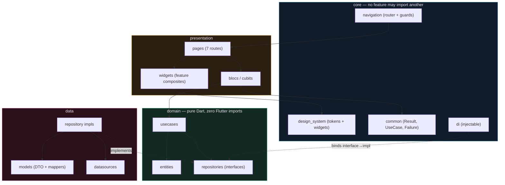

# Architecture

Layer graph, dependency rules, and the four deep-module seams that carry the leverage.

**Contains §4** of the original plan. Section numbers are preserved so existing cross-references keep resolving.

> [Index](README.md) · [Design system](03-design-system.md) · [Domain model](05-domain-model.md)

---

## 4. Architecture

### 4.1 Layer graph



### 4.2 Enforcement

- **Domain purity:** `features/*/domain/**` must not `import 'package:flutter/...'`. Enforce with a lint rule or a CI grep:

  ```bash
  ! grep -rn "package:flutter/" lib/features/*/domain/ || (echo "domain layer leaked Flutter" && exit 1)
  ```

- **Feature isolation:** `features/*/presentation` must not import another feature's `presentation`. Cross-feature navigation goes through `auto_route`; cross-feature data goes through `domain` interfaces.
- **No `setState` for business state.** `setState` is permitted only for ephemeral animation controllers inside a widget's own `State`.

### 4.3 Deep-module seams

Per the `codebase-design` vocabulary, four seams carry most of the leverage:

| Seam | Interface | What it hides | Payoff |
| --- | --- | --- | --- |
| `ThemeExtension<EvaColors>` | `context.colors.ember` | 24 hex values, 2 themes, alpha derivation | kills `useHex()` + `rgba()` at 60+ call sites |
| `GlassSurface` | `GlassSurface.tint(...)` / `.blur(...)` | `BackdropFilter` cost, hairline, radius, padding | 10 sites → 1 |
| `NeuralBackground` | `NeuralBackground(variant: NeuralVariant.home, tier: ...)` | `Ticker` lifecycle, hue-rotation matrix, orb config, perf tier | 8 scaffolds + 8 orb tables → 1 |
| `ReadingPage` | `ReadingPage(passageId:, language:)` | font, direction, alignment, verse markers, RTL chrome | 2 screens → 1 |

**One adapter means a hypothetical seam.** `NeuralVariant` is an enum, not a `Map<String, List<Orb>>` passed in from outside — no caller ever supplies a custom orb table, so there is no seam there, just a constant.

---
