# Widget Inventory

The **37** widgets the six shipped screens need, the duplication each one collapses, and the candidates that were deliberately *not* promoted.

**Contains §3 §6** of the original plan. Section numbers are preserved so existing cross-references keep resolving.

> [Index](README.md) · [Design system](03-design-system.md) · [File map](07-file-map.md) · [Authority](../agents/AGENT_CONTEXT.md)

---

> **Scope correction.** Library and Profile were cut — see [AGENT_CONTEXT](../agents/AGENT_CONTEXT.md) §2, decision 1. This inventory now describes the widget set for the **six** shipped screens: `/login`, `/`, `/reading`, `/quiz`, `/result`, `/settings`.
>
> Five entries were removed: the Home "continue reading" hero block, the 7-category chip row, the library grid card, and the profile reflection timeline **together with its row child** — the row existed only to be a child of the timeline. **42 → 37.**
>
> Every count below is recomputed from the survivors. Home's "continue reading" hero is replaced by a today's-reading panel, which is a composition of primitives already in this inventory (`GlassSurface` + `AppTopBar` + `EvaButton`) and stays **feature-local**, not a shared design-system widget.

## 3. Duplication inventory

These are the patterns that must **not** be carried into Dart. Each is a candidate for a single reusable widget.

**Counting basis:** the **Copies** column is the number of call sites that *survive* the Library + Profile cut, verified against `eva/src/`. Sites that lived only on the profile screen, or inside Home's library block (category chips, passage grid, continue-reading hero), are excluded.

| Pattern | Copies | Where | New widget |
| --- | --- | --- | --- |
| Screen root scaffold (`flex:1` + canvas + column + `minHeight:844` + `NeuralBackground` + z-index ladder) | **6** | the six shipped screens | `NeuralScaffold` |
| Glass/blur surface (`rgba()` + `backdropFilter` + hairline + radius) | **8** | 6 in `ds.tsx` (`Input`, `QuizOption`, `StatTile`, `SettingsTile`, FAB dock item, FAB button) + 2 inline (Login form, Home today's-reading panel) | `GlassSurface` |
| 44px icon button (back / chevron / close) | **4** | ReadingEn, ReadingAr, Quiz, Settings | `IconActionButton` |
| Reading control cluster (back + `Aa` + bookmark) | **2** | ReadingEn, ReadingAr | `ReadingControls` |
| Mono-caps pill button | **4 style defs / 11 rendered** | `App.tsx` theme toggle (1), `App.tsx` screen chips (1 def → 6, one per route), `QuizScreen` frame toggle (1 def → 2), FAB dock items (1 def → 2) | `EvaChip` |
| Segmented control | **2** | Settings theme, Settings language | `SegmentedControl<T>` |
| Reading EN vs AR screen body | **2 (~90%)** | `ReadingEnScreen`, `ReadingArScreen` | one `ReadingPage` |
| Passage drop-cap "I" | **1** | `ReadingEnScreen`'s first verse, reached through `ScriptureVerse.dropCap` | `PassageDropCap` |
| Sticky CTA (fade gradient + button + caption) | **2** | `ReadingEnScreen`, `ReadingArScreen` | `StickyCta` |
| Hairline divider | **3** | Login "or", Reading ×2 | `HairlineDivider` |
| Streak flame icon | **2** | `TopBar`, `ResultScreen` | `StreakFlame` |
| Avatar badge (gradient circle + initials) | **1** | `TopBar` | `AvatarBadge` |
| Settings controls (toggle / slider / segmented) | **1** | `SettingsScreen` | `SettingsGroup` |

**Totals:** 4 widgets collapse **25 call sites** — `NeuralScaffold` 6 + `GlassSurface` 8 + `IconActionButton` 4 + `EvaButton` 7 (`ButtonPrimary` 5 + `ButtonSecondary` 1 + `ButtonText` 1). Beyond that: 2 reading screens → 1 page, the settings surface becomes one composable `SettingsGroup`, and the mono-caps pill's 4 style definitions → 1 `EvaChip`.

> **Two prototype buttons left with the cut hero.** Home's hero carried a `ButtonPrimary` ("Continue") and a `ButtonText` ("Start reflection"); both die with it. The replacement today's-reading panel supplies its own single CTA, which is feature-local and is therefore not counted above.

### 3.1 Patterns that do NOT earn a widget

A candidate is only worth a widget if two or more call sites need it *and* deleting the widget makes complexity reappear. The cut changed the verdict on two candidates a pre-cut draft of this plan had already ruled on, and pushed six surviving widgets down to a single call site:

| Candidate | Call sites | Decision |
| --- | --- | --- |
| `EvaProgressBar` | **0** — the bar style (`height: 3`) existed only inside the library grid card, and the Home hero used `ProgressBeads` (dots), not a bar. Cutting the card removed the only site. | **Cut.** The public widget and its private `_PassageProgress` fallback both go with it. If a bar is ever needed again it is a 3-line private widget, not a design-system entry. |
| `SectionLabel` vs `ScreenSectionHeader` | **1** — the four group labels on `SettingsScreen`. Home's "Explore the library" header and the profile screen's headers were the other two, and both are cut. | **One widget**, not two: consolidated to `EvaSectionHeader` in Tier 1 with a `size` variant (`section` 16/700, `title` 17/800). **Now below the two-call-site bar** — re-check at Phase 1 and demote to a private widget inside the settings feature unless Home or Result adopts it. |

**Demotion watch list.** These six survive in the inventory but now have **one** shared call site each, so they no longer clear the §3.1 bar on their own: `AvatarBadge` (`AppTopBar`), `PassageDropCap` (`ScriptureVerse`), `SettingsGroup` (`SettingsScreen`), `EvaSectionHeader` (`SettingsScreen`), `TextLink` (Login's "Create account"), `ProgressBeads` (`QuizHeader`). Each is retained because the six-screen build genuinely needs the composition, not because the duplication justifies the public interface. **Phase 1 must re-run the deletion test on all six** and demote whatever complexity does not reappear — most likely to a private `_`-prefixed widget inside the feature that owns the single call site.

**Not a glass surface:** `StickyCta` (`ReadingEnScreen.tsx:80-86`) and the Quiz feedback banner (`QuizScreen.tsx:104-112`) look similar but use a solid `linear-gradient` / flat `rgba(ok, 0.1)` fill with **no** `backdropFilter`. They are separate composites, not `GlassSurface` instances.

---

## 6. Widget inventory

**37 public widgets across 4 tiers** — Tier 1: 18 · Tier 2: 7 · Tier 3: 12. Tier 0 is tokens and theme and contains no widgets.

Removed after the cut, and therefore absent from every list below: the Home continue-reading hero block, the category chip row, the library grid card, the profile reflection timeline, and that timeline's row child. `_PassageProgress` also went — it was private to the library card's file, so cutting that file removed its only home.

Each entry gives the widget's public constructor; the consolidating prototype source is stated in [§3](04-widget-inventory.md#3-duplication-inventory).

### Tier 0 — Foundations (no widgets)

| File | Contents |
| --- | --- |
| `tokens/eva_colors.dart` | `EvaColors`, `EvaColorsX.colors`, `EvaDark`, `EvaLight` |
| `tokens/eva_typography.dart` | `EvaTypography` (scripture AR/EN + display + mono caps) |
| `tokens/eva_spacing.dart` | `EvaSpacing` |
| `tokens/eva_radii.dart` | `EvaRadii` |
| `tokens/eva_motion.dart` | `EvaMotion` |
| `tokens/sticker_palette.dart` | `StickerSlot` enum, `StickerPalette` — decorative only (chips, dots, celebration). No longer keyed to any domain type. |
| `tokens/eva_fonts.dart` | `EvaFonts`, `evaScalerFor(int)` |
| `theme/eva_theme.dart` | `EvaTheme.dark()`, `EvaTheme.light()` |

### Tier 1 — Primitives

```dart
// 1. NeuralScaffold — the screen root. 6 copies → 1.
class NeuralScaffold extends StatelessWidget {
  const NeuralScaffold({
    required this.variant,
    required this.child,
    this.scrollable = false,
    this.padding = const EdgeInsets.symmetric(horizontal: EvaSpacing.lg),
    this.bottomFade = false,   // reading/quiz sticky-CTA scrim
    super.key,
  });
  final NeuralVariant variant;
  final Widget child;
  final bool scrollable;
  final EdgeInsets padding;
  final bool bottomFade;
}

// 2. GlassSurface — the one true surface. 8 blur sites → 1.
enum GlassTier { tint, blur }

class GlassSurface extends StatelessWidget {
  const GlassSurface({
    required this.child,
    this.tier = GlassTier.tint,
    this.radius = EvaRadii.card,      // 18
    this.padding = const EdgeInsets.all(EvaSpacing.lg),
    this.border = true,
    this.onTap,
    this.semanticLabel,
    super.key,
  });
}

// 3. EvaButton — 3 components → 1. 7 call sites.
enum EvaButtonVariant { primary, secondary, ghost }

class EvaButton extends StatelessWidget {
  const EvaButton({
    required this.label,
    this.onPressed,
    this.variant = EvaButtonVariant.primary,
    this.icon,
    this.trailingChevron = false,
    this.expanded = true,
    this.height = 52,
    super.key,
  });
}

// 4. EvaTextField — fixes #8, #10.
class EvaTextField extends StatefulWidget {
  const EvaTextField({
    required this.label,
    required this.controller,
    this.errorText,
    this.obscureText = false,
    this.keyboardType,
    this.textInputAction,
    this.onSubmitted,
    this.trailing,
    super.key,
  });
}

// 5. EvaChip — the theme toggle, the route chips, the Quiz frame
//     toggle and the 2 FAB dock items → 1.
enum EvaChipVariant { filter, static, toggle }

class EvaChip extends StatelessWidget {
  const EvaChip({
    required this.label,
    this.variant = EvaChipVariant.toggle,
    this.color,              // sticker colour
    this.selected = false,
    this.onSelected,
    this.leadingDot = true,
    super.key,
  });
}

// 6. ProgressBeads — one surviving shared call site: QuizHeader.
class ProgressBeads extends StatelessWidget {
  const ProgressBeads({required this.total, required this.completed, required this.current, super.key});
  final int total, completed, current;
}

// 7. StatTile · 8. SettingsTile · 9. SettingsGroup
class StatTile extends StatelessWidget {
  const StatTile({required this.value, required this.label, super.key});
}
class SettingsTile extends StatelessWidget {
  const SettingsTile({required this.title, required this.trailing, this.onTap, super.key});
}
class SettingsGroup extends StatelessWidget {
  const SettingsGroup({required this.label, required this.children, super.key});
}

// 10. EvaSectionHeader — consolidates the former `SectionLabel`
//     (shared DS) and `ScreenSectionHeader` (feature-local) into one
//     widget with a size variant. 1 surviving call site: Settings.
enum EvaSectionHeaderSize { title, section }

class EvaSectionHeader extends StatelessWidget {
  const EvaSectionHeader({
    required this.label,
    this.size = EvaSectionHeaderSize.section,
    this.trailing,
    super.key,
  });
  final String label;
  final EvaSectionHeaderSize size;
  final Widget? trailing;
}

// 11. SegmentedControl<T> — 2 copies → 1. Generic so AppThemeMode and
//     ScriptureLanguage both work without a second widget.
class SegmentedControl<T> extends StatelessWidget {
  const SegmentedControl({
    required this.values,
    required this.selected,
    required this.labelOf,
    required this.onChanged,
    super.key,
  });
  final List<T> values;
  final T selected;
  final String Function(T) labelOf;
  final ValueChanged<T> onChanged;
}

// 12. EvaToggle · 13. FontSizeStepper · 14. IconActionButton
//     (6 copies: back ×3, close, bookmark, Aa)
class EvaToggle extends StatelessWidget {
  const EvaToggle({required this.value, required this.onChanged, super.key});
}
class FontSizeStepper extends StatelessWidget {
  const FontSizeStepper({required this.step, required this.onChanged, super.key});
}
class IconActionButton extends StatelessWidget {
  const IconActionButton({
    required this.icon,
    required this.tooltip,   // also the Semantics label — fixes [09-quality-gates.md](09-quality-gates.md) §14
    this.onPressed,
    this.size = 44,
    super.key,
  });
}

// 15. HairlineDivider — with optional centred label (Login's "or")
class HairlineDivider extends StatelessWidget {
  const HairlineDivider({this.label, this.color, super.key});
}

// 16. TextLink — 1 surviving call site: Login's "Create account"
class TextLink extends StatelessWidget {
  const TextLink({required this.label, this.onPressed, this.color, super.key});
}

// 17. EmptyState · 18. ErrorView — the prototype has neither
class EmptyState extends StatelessWidget {
  const EmptyState({required this.icon, required this.title, required this.message, this.action, super.key});
}
class ErrorView extends StatelessWidget {
  const ErrorView({required this.message, this.onRetry, super.key});
}
```

### Tier 2 — Ambient & decorative

```dart
// 19. NeuralBackground — the identity layer. CustomPaint + Ticker. Never setState-per-frame.
enum NeuralVariant { login, home, readingEn, readingAr, quiz, result, settings }
enum NeuralTier { high, mid, low }   // low disables orbs + aurora entirely

class NeuralBackground extends StatelessWidget {
  const NeuralBackground({required this.variant, super.key});
  final NeuralVariant variant;
  // Reads EvaNeuralMotion from NeuralMotionScope. Deliberately not a
  // parameter — see [09-quality-gates.md](09-quality-gates.md) §13.2.
}

// 20. GoldFlecks — QuizScreen's 4 positioned flecks
class GoldFlecks extends StatelessWidget {
  const GoldFlecks({required this.offsets, this.dense = false, super.key});
  final List<Offset> offsets;   // in logical px from the parent's top-left
}

// 21. StreakFlame · 22. SunBurst (CustomPaint) · 23. AvatarBadge
class StreakFlame extends StatelessWidget { const StreakFlame({this.size = 18, super.key}); }
class SunBurst extends StatelessWidget { const SunBurst({this.size = 96, super.key}); }
class AvatarBadge extends StatelessWidget {
  const AvatarBadge({required this.initials, this.size = 32, this.onTap, super.key});
};

// 24. PassageDropCap — 1 copy; LTR + RTL aware via WidgetSpan
class PassageDropCap extends StatelessWidget {
  const PassageDropCap({
    required this.letter,
    this.language = ScriptureLanguage.en,
    this.lines = 3,
    super.key,
  });
}

// 25. SealMonogram — the "E" in Login + FAB
class SealMonogram extends StatelessWidget { const SealMonogram({this.size = 60, super.key}); }
```

### Tier 3 — Feature composites

```dart
// 26. AppTopBar — fixes #11. Fully data-driven.
class AppTopBar extends StatelessWidget {
  const AppTopBar({
    required this.wordmark,
    required this.streakDays,
    required this.initials,
    this.onAvatarTap,          // opens /settings — the profile screen was cut
    super.key,
  });
}

// 26b. BrandLockup — the Login hero block (LoginScreen.tsx:17-35):
//      SealMonogram + wordmark + tagline.
class BrandLockup extends StatelessWidget {
  const BrandLockup({
    required this.wordmark,
    required this.tagline,
    this.sealSize = 60,
    super.key,
  });
  final String wordmark, tagline;
  final double sealSize;
}

// 27. SealFab + 28. FabDockItem — fixes #7. Items are route-driven, never null-screen.
//      The dock is down to 2 items: Settings and Language.
class SealFab extends StatefulWidget {
  const SealFab({required this.actions, super.key});
  final List<FabDockItem> actions;
}
class FabDockItem {
  const FabDockItem({required this.label, required this.onPressed});
}

// 29. QuizOptionCard — 4 states
enum QuizOptionState { idle, selected, correct, incorrect }
class QuizOptionCard extends StatelessWidget {
  const QuizOptionCard({
    required this.letter, required this.text, required this.state,
    this.onTap, this.enabled = true, super.key,
  });
}

// 30. StickyCta — 2 copies
class StickyCta extends StatelessWidget {
  const StickyCta({required this.label, required this.caption, required this.onPressed, super.key});
}

// 31. ScriptureBlock + 32. ScriptureVerse — LTR + RTL from one widget
class ScriptureBlock extends StatelessWidget {
  const ScriptureBlock({required this.verses, required this.language, this.showVerseNumbers = true, super.key});
}
class ScriptureVerse extends StatelessWidget {
  const ScriptureVerse({required this.verse, required this.language, this.dropCap = false, this.showNumber = true, super.key});
};

// 33. ReadingControls (back + Aa + bookmark, direction-aware) — 2 copies
// 34. ScriptureMetadataRow (with gold flecks) — 2 copies
class ReadingControls extends StatelessWidget {
  const ReadingControls({required this.language, this.onBack, this.onFontSize, this.onBookmark, this.bookmarked = false, super.key});
}

// 35. QuizHeader (X + beads + spacer) · 36. FeedbackBanner (ok/err variants)
class QuizHeader extends StatelessWidget {
  const QuizHeader({required this.total, required this.completed, required this.current, this.onExit, super.key});
}
class FeedbackBanner extends StatelessWidget {
  const FeedbackBanner({required this.tone, required this.message, super.key});
}
```

**Tier 3 continues into `features/*/presentation/widgets/`** (feature-local composites, not part of the shared DS): `SocialAuthButton`, `GoogleMark`, `AppleMark`, `ResultScore`, `StreakPill`, `StatRow`.

> **Out of scope.** The backend serves no library, no category list, and no reflection history, so there is no shared widget for any of them. Home's today's-reading panel, the quiz option list, and the result stat rows are composed inside their own feature from the widgets above — do not promote them to `core/design_system`.

### Widget dependency graph

```mermaid
graph TD
    subgraph T1["Tier 1 — primitives"]
        NS["NeuralScaffold"]; GS["GlassSurface"]; EB["EvaButton"]; TF["EvaTextField"]
        CH["EvaChip"]; PB2["ProgressBeads"]; ST["StatTile"]
        SH["EvaSectionHeader"]
        SET["SettingsTile / SettingsGroup"]; SC["SegmentedControl&lt;T&gt;"]
        TG["EvaToggle"]; FS["FontSizeStepper"]; IAB["IconActionButton"]
        HD["HairlineDivider"]; TL["TextLink"]; ES["EmptyState / ErrorView"]
    end
    subgraph T2["Tier 2 — ambient"]
        NB["NeuralBackground"]; GF["GoldFlecks"]; SF["StreakFlame"]
        SB["SunBurst"]; AB["AvatarBadge"]; DC["PassageDropCap"]; SM["SealMonogram"]
    end
    subgraph T3["Tier 3 — feature composites"]
        TB["AppTopBar"]; BR["BrandLockup"]; FAB["SealFab"]
        QOC["QuizOptionCard"]; SCTA["StickyCta"]; SBK["ScriptureBlock"]
        RCTR["ReadingControls"]; SMR["ScriptureMetadataRow"]
        QH["QuizHeader"]; FB["FeedbackBanner"]
    end

    NS --> NB
    GS --> NB
    T2 --> T1
    T3 --> T2
    T3 --> T1
    SBK --> DC
    SCTA --> EB
    RCTR --> IAB
    FAB --> CH
    QH --> PB2
    QOC --> GF
    SMR --> GF
    FB --> SF
    TB --> SF
    TB --> AB
    BR --> SM
    SET --> SC
    SET --> TG
    SET --> FS

    style T1 fill:#2a1f10,stroke:#E8A33D,color:#EAE8F5
    style T2 fill:#1f132a,stroke:#B79CF0,color:#EAE8F5
    style T3 fill:#10262a,stroke:#4EC9BD,color:#EAE8F5
```



---
