# Widget Inventory

The 42 widgets, the duplication each one collapses, and the candidates that were deliberately *not* promoted.

**Contains §3 §6** of the original plan. Section numbers are preserved so existing cross-references keep resolving.

> [Index](README.md) · [Design system](03-design-system.md) · [File map](07-file-map.md)

---

## 3. Duplication inventory

These are the patterns that must **not** be carried into Dart. Each is a candidate for a single reusable widget.

| Pattern | Copies | Where | New widget |
| --- | --- | --- | --- |
| Screen root scaffold (`flex:1` + canvas + column + `minHeight:844` + `NeuralBackground` + z-index ladder) | **8** | all screens | `NeuralScaffold` |
| Glass/blur surface (`rgba()` + `backdropFilter` + hairline + radius) | **10** | 7 in `ds.tsx` (`Input`, `PassageCard`, `QuizOption`, `StatTile`, `SettingsTile`, FAB dock item, FAB button) + 3 inline (Login form, Home hero, Profile journey) | `GlassSurface` |
| 44px icon button (back / chevron / close) | **5** | ReadingEn, ReadingAr, Quiz, Profile, Settings | `IconActionButton` |
| Reading control cluster (back + `Aa` + bookmark) | **2** | ReadingEn, ReadingAr | `ReadingControls` |
| Mono-caps pill button | **4 style defs / 14 rendered** | `App.tsx` theme toggle (1), `App.tsx` screen chips (1 def → 8), `QuizScreen` frame toggle (1 def → 2), FAB dock items (1 def → 3) | `EvaChip` |
| Segmented control | **3** | Profile theme, Settings theme, Settings language | `SegmentedControl<T>` |
| Reading EN vs AR screen body | **2 (~90%)** | `ReadingEnScreen`, `ReadingArScreen` | one `ReadingPage` |
| Passage drop-cap "I" | **2** | Home hero, `ReadingEnScreen` | `PassageDropCap` |
| Sticky CTA (fade gradient + button + caption) | **2** | `ReadingEnScreen`, `ReadingArScreen` | `StickyCta` |
| Hairline divider | **3** | Login "or", Reading ×2 | `HairlineDivider` |
| Streak flame icon | **2** | `TopBar`, `ResultScreen` | `StreakFlame` |
| Avatar badge (gradient circle + initials) | **2** | `TopBar`, `ProfileScreen` | `AvatarBadge` |
| Settings controls (toggle / slider / segmented) | **2** | `ProfileScreen`, `SettingsScreen` | `SettingsGroup` |

**Totals:** 4 widgets collapse **32 call sites** — `NeuralScaffold` 8 + `GlassSurface` 10 + `IconActionButton` 5 + `EvaButton` 9 (`ButtonPrimary` 6 + `ButtonSecondary` 1 + `ButtonText` 2). Beyond that: 2 reading screens → 1 page, 2 settings surfaces → 1 composable `SettingsGroup`, and the mono-caps pill's 4 style definitions → 1 `EvaChip`.

### 3.1 Patterns that do NOT earn a widget

A candidate is only worth a widget if two or more call sites need it *and* deleting the widget makes complexity reappear. Two candidates in an earlier draft of this plan failed that test and were demoted:

| Candidate | Call sites | Decision |
| --- | --- | --- |
| `EvaProgressBar` | **1** — the bar style (`height: 3`) exists only in `ds.tsx` `PassageCard`; the Home hero uses `ProgressBeads` (dots), not a bar | **Not a widget.** Becomes a private `_PassageProgress` inside `passage_card.dart`. One call site and no variation makes a public interface pure indirection. |
| `SectionLabel` vs `ScreenSectionHeader` | **3** — Home "Explore the library", Profile "Journey"/"Settings", Settings' four group labels | **One widget**, not two. `SectionLabel` (shared DS) and `ScreenSectionHeader` (feature-local) were the same idea split across two homes. Consolidated to `EvaSectionHeader` in Tier 1 with a `size` variant (`section` 16/700, `title` 17/800). |

**Not a glass surface:** `StickyCta` (`ReadingEnScreen.tsx:80-86`) and the Quiz feedback banner (`QuizScreen.tsx:104-112`) look similar but use a solid `linear-gradient` / flat `rgba(ok, 0.1)` fill with **no** `backdropFilter`. They are separate composites, not `GlassSurface` instances.

---

## 6. Widget inventory

41 widgets across 4 tiers (42 counting `BrandLockup`, added after review; `EvaProgressBar` was demoted to a private widget and `SectionLabel` merged into `EvaSectionHeader` — see §3.1). Each entry gives the widget's public constructor; the consolidating prototype source is stated in [§3](04-widget-inventory.md#3-duplication-inventory).

### Tier 0 — Foundations (no widgets)

| File | Contents |
| --- | --- |
| `tokens/eva_colors.dart` | `EvaColors`, `EvaColorsX.colors`, `EvaDark`, `EvaLight` |
| `tokens/eva_typography.dart` | `EvaTypography` (scripture AR/EN + display + mono caps) |
| `tokens/eva_spacing.dart` | `EvaSpacing` |
| `tokens/eva_radii.dart` | `EvaRadii` |
| `tokens/eva_motion.dart` | `EvaMotion` |
| `tokens/sticker_palette.dart` | `StickerSlot` enum, `StickerPalette` |
| `tokens/eva_fonts.dart` | `EvaFonts`, `evaScalerFor(int)` |
| `theme/eva_theme.dart` | `EvaTheme.dark()`, `EvaTheme.light()` |

### Tier 1 — Primitives

```dart
// 1. NeuralScaffold — the screen root. 8 copies → 1.
class NeuralScaffold extends StatelessWidget {
  const NeuralScaffold({
    required this.variant,
    required this.child,
    this.scrollable = false,
    this.padding = const EdgeInsets.symmetric(horizontal: EvaSpacing.lg),
    this.bottomFade = false,   // reading/quiz sticky-CTA scrim
    super.key,
  });
  final NeuralVariant variant;
  final Widget child;
  final bool scrollable;
  final EdgeInsets padding;
  final bool bottomFade;
}

// 2. GlassSurface — the one true surface. 10 blur sites → 1.
enum GlassTier { tint, blur }

class GlassSurface extends StatelessWidget {
  const GlassSurface({
    required this.child,
    this.tier = GlassTier.tint,
    this.radius = EvaRadii.card,      // 18
    this.padding = const EdgeInsets.all(EvaSpacing.lg),
    this.border = true,
    this.onTap,
    this.semanticLabel,
    super.key,
  });
}

// 3. EvaButton — 3 components → 1. 9 call sites.
enum EvaButtonVariant { primary, secondary, ghost }

class EvaButton extends StatelessWidget {
  const EvaButton({
    required this.label,
    this.onPressed,
    this.variant = EvaButtonVariant.primary,
    this.icon,
    this.trailingChevron = false,
    this.expanded = true,
    this.height = 52,
    super.key,
  });
}

// 4. EvaTextField — fixes #8, #10.
class EvaTextField extends StatefulWidget {
  const EvaTextField({
    required this.label,
    required this.controller,
    this.errorText,
    this.obscureText = false,
    this.keyboardType,
    this.textInputAction,
    this.onSubmitted,
    this.trailing,
    super.key,
  });
}

// 5. EvaChip — CategoryChip + 4 inline pill variants → 1.
enum EvaChipVariant { filter, category, static }

class EvaChip extends StatelessWidget {
  const EvaChip({
    required this.label,
    this.variant = EvaChipVariant.filter,
    this.color,              // sticker colour
    this.selected = false,
    this.onSelected,
    this.leadingDot = true,
    super.key,
  });
}

// 6. ProgressBeads
class ProgressBeads extends StatelessWidget {
  const ProgressBeads({required this.total, required this.completed, required this.current, super.key});
  final int total, completed, current;
}

// 7. PassageCard's private progress bar — NOT a public widget.
//    One call site and no variation (see §3.1), so it stays private to
//    the file that owns it. Kept here only to show the geometry.
class _PassageProgress extends StatelessWidget {
  const _PassageProgress({required this.value, required this.total, super.key});
  final int value, total;

  @override
  Widget build(BuildContext context) {
    final colors = context.colors;
    return Column(
      crossAxisAlignment: CrossAxisAlignment.start,
      children: [
        ClipRRect(
          borderRadius: BorderRadius.circular(999),
          child: SizedBox(
            height: 3,
            child: LinearProgressIndicator(
              value: total == 0 ? 0 : value / total,
              backgroundColor: colors.ink.withValues(alpha: 0.10),
              valueColor: AlwaysStoppedAnimation(
                LinearGradient(
                  colors: [colors.ember, context.stickers.sun],
                ).createShader(const Rect.fromLTWH(0, 0, 1, 3)),
              ),
            ),
          ),
        ),
        const SizedBox(height: 5),
      ],
    );
  }
}

// 8. StatTile · 9. SettingsTile · 10. SettingsGroup
class StatTile extends StatelessWidget {
  const StatTile({required this.value, required this.label, super.key});
}
class SettingsTile extends StatelessWidget {
  const SettingsTile({required this.title, required this.trailing, this.onTap, super.key});
}
class SettingsGroup extends StatelessWidget {
  const SettingsGroup({required this.label, required this.children, super.key});
}

// 11. EvaSectionHeader — consolidates the former `SectionLabel`
//     (shared DS) and `ScreenSectionHeader` (feature-local) into one
//     widget with a size variant. 3 call sites: Home, Profile, Settings.
enum EvaSectionHeaderSize { title, section }

class EvaSectionHeader extends StatelessWidget {
  const EvaSectionHeader({
    required this.label,
    this.size = EvaSectionHeaderSize.section,
    this.trailing,
    super.key,
  });
  final String label;
  final EvaSectionHeaderSize size;
  final Widget? trailing;
}

// 12. SegmentedControl<T> — 3 copies → 1. Generic so ThemeMode and
//     ScriptureLanguage both work without a second widget.
class SegmentedControl<T> extends StatelessWidget {
  const SegmentedControl({
    required this.values,
    required this.selected,
    required this.labelOf,
    required this.onChanged,
    super.key,
  });
  final List<T> values;
  final T selected;
  final String Function(T) labelOf;
  final ValueChanged<T> onChanged;
}

// 13. EvaToggle · 14. FontSizeStepper · 15. IconActionButton
//     (6 copies: back ×4, close, bookmark, Aa)
class EvaToggle extends StatelessWidget {
  const EvaToggle({required this.value, required this.onChanged, super.key});
}
class FontSizeStepper extends StatelessWidget {
  const FontSizeStepper({required this.step, required this.onChanged, super.key});
}
class IconActionButton extends StatelessWidget {
  const IconActionButton({
    required this.icon,
    required this.tooltip,   // also the Semantics label — fixes [09-quality-gates.md](09-quality-gates.md) §14
    this.onPressed,
    this.size = 44,
    super.key,
  });
}

// 16. HairlineDivider — with optional centred label (Login's "or")
class HairlineDivider extends StatelessWidget {
  const HairlineDivider({this.label, this.color, super.key});
}

// 17. TextLink — replaces 3 inline "Create account" / "Edit" / "Sign out"
class TextLink extends StatelessWidget {
  const TextLink({required this.label, this.onPressed, this.color, super.key});
}

// 18. EmptyState · 19. ErrorView — the prototype has neither
class EmptyState extends StatelessWidget {
  const EmptyState({required this.icon, required this.title, required this.message, this.action, super.key});
}
class ErrorView extends StatelessWidget {
  const ErrorView({required this.message, this.onRetry, super.key});
}
```

### Tier 2 — Ambient & decorative

```dart
// 20. NeuralBackground — the identity layer. CustomPaint + Ticker. Never setState-per-frame.
enum NeuralVariant { login, home, readingEn, readingAr, quiz, result, profile, settings }
enum NeuralTier { high, mid, low }   // low disables orbs + aurora entirely

class NeuralBackground extends StatelessWidget {
  const NeuralBackground({required this.variant, super.key});
  final NeuralVariant variant;
  // Reads EvaNeuralMotion from NeuralMotionScope. Deliberately not a
  // parameter — see [09-quality-gates.md](09-quality-gates.md) [09-quality-gates.md](09-quality-gates.md) §13.2.
}

// 21. GoldFlecks — QuizScreen's 4 positioned flecks
class GoldFlecks extends StatelessWidget {
  const GoldFlecks({required this.offsets, this.dense = false, super.key});
  final List<Offset> offsets;   // in logical px from the parent's top-left
}

// 22. StreakFlame · 23. SunBurst (CustomPaint) · 24. AvatarBadge
class StreakFlame extends StatelessWidget { const StreakFlame({this.size = 18, super.key}); }
class SunBurst extends StatelessWidget { const SunBurst({this.size = 96, super.key}); }
class AvatarBadge extends StatelessWidget {
  const AvatarBadge({required this.initials, this.size = 32, this.onTap, super.key});
};

// 25. PassageDropCap — 2 copies; LTR + RTL aware via WidgetSpan
class PassageDropCap extends StatelessWidget {
  const PassageDropCap({
    required this.letter,
    this.language = ScriptureLanguage.en,
    this.lines = 3,
    super.key,
  });
}

// 26. SealMonogram — the "E" in Login + FAB
class SealMonogram extends StatelessWidget { const SealMonogram({this.size = 60, super.key}); }
```

### Tier 3 — Feature composites

```dart
// 27. AppTopBar — fixes #11. Fully data-driven.
class AppTopBar extends StatelessWidget {
  const AppTopBar({
    required this.wordmark,
    required this.streakDays,
    required this.initials,
    this.onAvatarTap,
    super.key,
  });
}

// 27b. BrandLockup — the Login hero block (LoginScreen.tsx:17-35):
//      SealMonogram + wordmark + tagline. The only unmapped prototype
//      composition in the original plan; added after review.
class BrandLockup extends StatelessWidget {
  const BrandLockup({
    required this.wordmark,
    required this.tagline,
    this.sealSize = 60,
    super.key,
  });
  final String wordmark, tagline;
  final double sealSize;
}

// 28. SealFab + 29. FabDockItem — fixes #7. Items are route-driven, never null-screen.
class SealFab extends StatefulWidget {
  const SealFab({required this.actions, super.key});
  final List<FabDockItem> actions;
}
class FabDockItem {
  const FabDockItem({required this.label, required this.onPressed});
}

// 30. ContinueReadingPanel — HomeScreen's 45-line hero
class ContinueReadingPanel extends StatelessWidget {
  const ContinueReadingPanel({
    required this.reference, required this.preview, required this.excerpt,
    required this.completed, required this.total,
    required this.onContinue, required this.onReflect,
    super.key,
  });
}

// 31. CategoryFilterBar — horizontal scrolling, real filtering (fixes #1)
class CategoryFilterBar extends StatelessWidget {
  const CategoryFilterBar({
    required this.categories, required this.selected, required this.onSelected,
    super.key,
  });
}

// 32. PassageCard
class PassageCard extends StatelessWidget {
  const PassageCard({
    required this.reference, required this.preview, required this.category,
    required this.completed, required this.total,
    this.onTap,
    super.key,
  });
}

// 33. QuizOptionCard — 4 states
enum QuizOptionState { idle, selected, correct, incorrect }
class QuizOptionCard extends StatelessWidget {
  const QuizOptionCard({
    required this.letter, required this.text, required this.state,
    this.onTap, this.enabled = true, super.key,
  });
}

// 34. StickyCta — 2 copies
class StickyCta extends StatelessWidget {
  const StickyCta({required this.label, required this.caption, required this.onPressed, super.key});
}

// 35. ScriptureBlock + 36. ScriptureVerse — LTR + RTL from one widget
class ScriptureBlock extends StatelessWidget {
  const ScriptureBlock({required this.verses, required this.language, this.showVerseNumbers = true, super.key});
}
class ScriptureVerse extends StatelessWidget {
  const ScriptureVerse({required this.verse, required this.language, this.dropCap = false, this.showNumber = true, super.key});
};

// 37. ReadingControls (back + Aa + bookmark, direction-aware) — 2 copies
// 38. ScriptureMetadataRow (with gold flecks) — 2 copies
class ReadingControls extends StatelessWidget {
  const ReadingControls({required this.language, this.onBack, this.onFontSize, this.onBookmark, this.bookmarked = false, super.key});
}

// 39. QuizHeader (X + beads + spacer) · 40. FeedbackBanner (ok/err variants)
class QuizHeader extends StatelessWidget {
  const QuizHeader({required this.total, required this.completed, required this.current, this.onExit, super.key});
}
class FeedbackBanner extends StatelessWidget {
  const FeedbackBanner({required this.tone, required this.message, super.key});
}

// 41. JourneyTimeline + JourneyRow
class JourneyTimeline extends StatelessWidget {
  const JourneyTimeline({required this.records, super.key});
}
```

**Tier 3 continues into `features/*/presentation/widgets/`** (feature-local composites, not part of the shared DS): `SocialAuthButton`, `GoogleMark`, `AppleMark`, `ResultScore`, `StreakPill`, `StatRow`.

### Widget dependency graph

```mermaid
graph TD
    subgraph T1["Tier 1 — primitives"]
        NS["NeuralScaffold"]; GS["GlassSurface"]; EB["EvaButton"]; TF["EvaTextField"]
        CH["EvaChip"]; PB2["ProgressBeads"]; PBar["_PassageProgress (private)"]; ST["StatTile"]
        SH["EvaSectionHeader"]
        SET["SettingsTile / SettingsGroup"]; SC["SegmentedControl&lt;T&gt;"]
        TG["EvaToggle"]; FS["FontSizeStepper"]; IAB["IconActionButton"]
        HD["HairlineDivider"]; TL["TextLink"]; ES["EmptyState / ErrorView"]
    end
    subgraph T2["Tier 2 — ambient"]
        NB["NeuralBackground"]; GF["GoldFlecks"]; SF["StreakFlame"]
        SB["SunBurst"]; AB["AvatarBadge"]; DC["PassageDropCap"]; SM["SealMonogram"]
    end
    subgraph T3["Tier 3 — feature composites"]
        TB["AppTopBar"]; FAB["SealFab"]; CRP["ContinueReadingPanel"]
        CFB["CategoryFilterBar"]; PC["PassageCard"]; QOC["QuizOptionCard"]
        SCTA["StickyCta"]; SBK["ScriptureBlock"]; RCTR["ReadingControls"]
        QH["QuizHeader"]; FB["FeedbackBanner"]; JT["JourneyTimeline"]
    end

    NS --> NB
    GS --> NB
    T2 --> T1
    T3 --> T2
    T3 --> T1
    PC --> CH
    PC --> PBar
    CRP --> PB2
    CRP --> DC
    CRP --> EB
    CFB --> CH
    SBK --> DC
    SCTA --> EB
    QH --> PB2
    QOC --> GF
    FB --> SF
    TB --> SF
    TB --> AB
    JT --> AB
    SET --> SC
    SET --> TG
    SET --> FS

    style T1 fill:#2a1f10,stroke:#E8A33D,color:#EAE8F5
    style T2 fill:#1f132a,stroke:#B79CF0,color:#EAE8F5
    style T3 fill:#10262a,stroke:#4EC9BD,color:#EAE8F5
```



---
