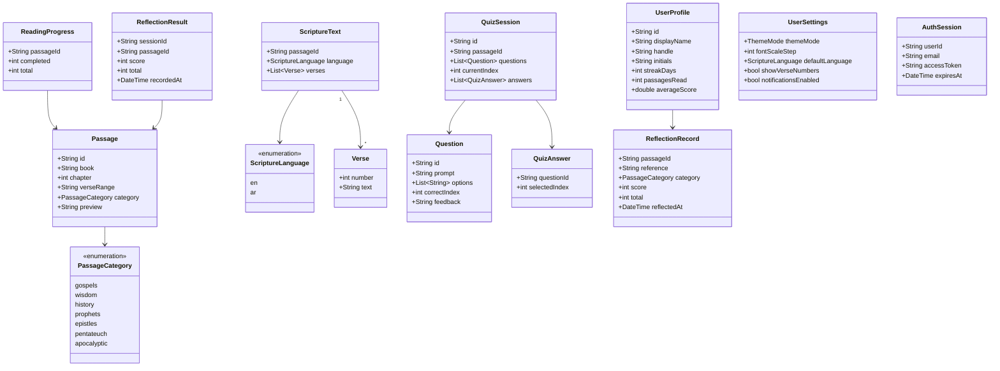

# Domain Model

Entities, the passage→sticker mapping, and the use cases that form the domain seam.

**Contains §9** of the original plan. Section numbers are preserved so existing cross-references keep resolving.

> [Index](README.md) · [Architecture](02-architecture.md) · [File map](07-file-map.md)

---

## 9. Domain model



`PassageCategory` has 7 values. The brief's usage map assigns: gospels → sun, poetry/wisdom → lavender, history → sky, prophets → coral, epistles → teal, pentateuch → leaf, apocalyptic → pink. The React prototype implemented only 5 of the 7 (`CAT_COLORS` in `HomeScreen.tsx:6-9`) — port all 7.

**Sticker mapping ownership.** `StickerSlot` is a design-system type; `PassageCategory` is a domain type. `core/design_system` must not import `features/library/domain`, so the mapping cannot live in the design system. It belongs in the library feature's presentation layer as a single explicit switch — exhaustive by construction, and the compiler catches a new category:

```dart
// lib/features/library/presentation/passage_category_presentation.dart
extension PassageCategorySticker on PassageCategory {
  StickerSlot get sticker => switch (this) {
        PassageCategory.gospels     => StickerSlot.sun,
        PassageCategory.wisdom     => StickerSlot.lavender,
        PassageCategory.history     => StickerSlot.sky,
        PassageCategory.prophets    => StickerSlot.coral,
        PassageCategory.epistles    => StickerSlot.teal,
        PassageCategory.pentateuch  => StickerSlot.leaf,
        PassageCategory.apocalyptic => StickerSlot.pink,
      };
}
```

**Use cases** (`core/common/usecase.dart`):

```dart
abstract interface class UseCase<In, Out> { Future<Out> call(In input); }
abstract interface class NoParamsUseCase<Out> { Future<Out> call(); }
```

| Feature | Use cases |
| --- | --- |
| auth | `SignIn`, `SignOut`, `GetCurrentSession` |
| library | `GetPassages`, `FilterPassagesByCategory`, `GetContinueReading` |
| reading | `GetPassageText`, `ToggleBookmark` |
| quiz | `StartSession`, `SubmitAnswer`, `CompleteSession`, `GetReflectionHistory` |
| profile | `GetUserProfile`, `GetUserStats`, `GetJourney`, `GetSettings`, `UpdateSettings` |

Every use case returns `Result<T>` (`core/common/result.dart`) — no throwing across the domain seam.

---
