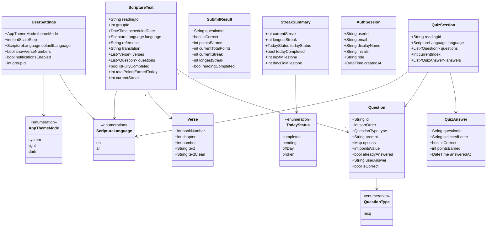

# Domain Model

Entities, the four repository ports, and the use cases that form the domain seam.

**Contains §9** of the original plan. Section numbers are preserved so existing cross-references keep resolving.

> [Index](README.md) · [Architecture](02-architecture.md) · [File map](07-file-map.md) · [Authority](../agents/AGENT_CONTEXT.md)

---

> **Scope correction.** The model is now shaped by the **live API** at `http://localhost:3000` (prefix `/api/v1`), not by bundled JSON corpora. See [AGENT_CONTEXT](../agents/AGENT_CONTEXT.md) §2 and §5. Anything the API does not return is not modelled, and anything it returns but the old model lacked is added here.
>
> Six types were **cut**: the 7-value category enum, the passage aggregate, the progress record that pointed at it, the reflection result, the reflection record, and the user profile. **Eight types were added**: the streak summary, the submit result, the streak-status and question-type enumerations, and the fields the localized reading response actually carries.

## 9. Domain model

**9 entities + 4 supporting enums = 13 domain types.**

| # | Type | Kind | Why it exists |
| --- | --- | --- | --- |
| 1 | `ScriptureText` | entity | Aggregate for `GET /readings/today/{en,ar}` — identity, schedule, verses, questions, completion |
| 2 | `Verse` | entity | One verse of a `ScriptureText` |
| 3 | `Question` | entity | One MCQ, including the server's per-user answer state |
| 4 | `QuizSession` | entity | **Client-side only** — the ordered question run for today's reading |
| 5 | `QuizAnswer` | entity | One submitted letter plus the outcome the API returned |
| 6 | `SubmitResult` | entity | Response of `POST /readings/:id/submit`; the `/result` screen's whole data source |
| 7 | `StreakSummary` | entity | Response of `GET /streak/summary` |
| 8 | `AuthSession` | entity | Seeded identity for `X-User-Id` / `X-User-Role`. **Faked** — see below |
| 9 | `UserSettings` | entity | Appearance + reading preferences, persisted locally only |
| — | `ScriptureLanguage` | enum | `en` \| `ar` |
| — | `AppThemeMode` | enum | `system` \| `light` \| `dark` — the domain's own enum, **not** Flutter's `ThemeMode` |
| — | `QuestionType` | enum | `mcq` today; a new value is added by extending the enum and its mapper |
| — | `TodayStatus` | enum | `completed` \| `pending` \| `offDay` \| `broken` |

Nullable members are drawn without `?` so the diagram parses everywhere. The authoritative signatures are the Dart sketches in [§9.1](#91-field-notes--the-api-facts-that-drive-the-shape); the nullable fields are `Verse.textClean`, `Question.userAnswer`, `Question.isCorrect`, and `StreakSummary.nextMilestone` / `daysToMilestone`.



### 9.1 Field notes — the API facts that drive the shape

**`Verse.textClean` is nullable, and it is null for English.** The Arabic localized response carries `text_clean`; the English one omits the key entirely — it is not an empty string. [AGENT_CONTEXT](../agents/AGENT_CONTEXT.md) §5, trap 2. The mapper must not assert its presence:

```dart
class Verse {
  const Verse({
    required this.bookNumber,
    required this.chapter,
    required this.number,
    required this.text,
    this.textClean,   // AR only; absent from the EN payload, so never assert
  });

  final int bookNumber, chapter, number;
  final String text;
  final String? textClean;
}
```

**`Question` carries the user's answer state.** The old model had `correctIndex` and `feedback`, which a bundled-JSON plan could afford because the answer key shipped with the data. The API does **not** send the key. It sends what this user has already done:

```dart
class Question {
  const Question({
    required this.id,
    required this.sortOrder,
    required this.type,
    required this.prompt,
    required this.options,          // flat Map<String, String>: 'A' → text
    required this.pointsValue,
    required this.alreadyAnswered,
    this.userAnswer,                // 'A'..'D' or null
    this.isCorrect,                 // bool? or null — null until answered
  });

  final String id;
  final int sortOrder, pointsValue;
  final QuestionType type;
  final String prompt;
  final Map<String, String> options;
  final bool alreadyAnswered;
  final String? userAnswer;
  final bool? isCorrect;
}
```

Three consequences the client must honour:

- Options are a **flat letter → text map**, not a list. `QuizAnswer.selectedLetter` is therefore a `String`, not an index, and the submit body is `{"question_id": "<uuid>", "answer": "<letter>"}`.
- `already_answered == true` means the question must be **disabled in the quiz**, not discovered as a `409` on submit. [AGENT_CONTEXT](../agents/AGENT_CONTEXT.md) §5, trap 3.
- The correct answer is revealed **only** by `SubmitResult.isCorrect`. Nothing in `Question` may be used to score locally.

**`QuizSession` is client-side.** There is no session endpoint and no session id. The session is identified by `readingId` and exists only in `QuizBloc` state. Because the backend has **no `GET /readings/:id`**, re-entering `/quiz` re-fetches `GET /readings/today/{lang}` to obtain fresh `already_answered` flags rather than trusting cached state.

**`StreakSummary.todayStatus` is a closed set of four.** The wire value `off_day` maps to `TodayStatus.offDay`; every other value is `snake_case` and must be converted explicitly. Use `.name`, never `describeEnum` ([AGENT_CONTEXT](../agents/AGENT_CONTEXT.md) §4).

**`SubmitResult` is the only data source for `/result`.** Note `readingCompleted` — streak fields move **only** when it is `true`. A single correct answer does not advance the streak. [AGENT_CONTEXT](../agents/AGENT_CONTEXT.md) §5, trap 4.

**`AuthSession` is real as an interface, fake as an implementation.** The backend exposes **no auth endpoint** and performs **no validation of any kind** — identity is three headers. So `AuthSession` carries no token and no expiry: it carries the values the client sends as headers.

```dart
class AuthSession {
  const AuthSession({
    required this.userId,       // MUST be a valid UUID — empty → 401, absent → 400
    required this.email,
    required this.displayName,
    required this.initials,
    this.role = 'kid',          // parsed by the backend, never checked — do not gate UI on it
    required this.createdAt,
  });
  ...
}
```

`FakeAuthRepository` returns the seeded session from [AGENT_CONTEXT](../agents/AGENT_CONTEXT.md) §5 (`11111111-1111-1111-1111-111111111111`, group `3`). The port stays real so a `DioAuthRepository` can replace it without touching `domain` or `presentation`.

**`UserSettings` must not import Flutter.** The pre-cut model typed `themeMode` as Flutter's `ThemeMode`, which leaks `package:flutter/material.dart` into `features/*/domain/` and fails the layer-purity gate in [AGENT_CONTEXT](../agents/AGENT_CONTEXT.md) §7. `UserSettings` therefore declares `AppThemeMode`, and the presentation layer maps it to `ThemeMode` at the `MaterialApp` boundary. Settings are **local only** (`shared_preferences`) — there is no settings endpoint, so there is no sync path and no conflict model.

### 9.2 Cut types

> **Cut.** The 7-value category enum, the passage aggregate, the progress record that pointed at it, the reflection result, the reflection record, and the user profile are gone. The backend serves **no passage list, no category taxonomy, and no reflection history**, so there is nothing for an exhaustive category → sticker-slot switch to be exhaustive over. `StickerSlot` survives in the design system as a purely decorative palette (chips, dots, celebration) with no domain binding.

### 9.3 Repository ports — exactly four

```dart
abstract interface class ReadingRepository {
  Future<Result<ScriptureText>> getTodaysReading(ScriptureLanguage language);
  Future<Result<SubmitResult>> submitAnswer({
    required String readingId,
    required String questionId,
    required String answer,
  });
}

abstract interface class StreakRepository {
  Future<Result<StreakSummary>> getSummary();
}

abstract interface class AuthRepository {
  Future<Result<AuthSession>> signIn({required String email, required String password});
  Future<Result<AuthSession>> getCurrentSession();
  Future<Result<void>> signOut();
}

abstract interface class SettingsRepository {
  Future<Result<UserSettings>> getSettings();
  Future<Result<UserSettings>> updateSettings(UserSettings settings);
}
```

| Consumer | Port it depends on | Why not a wider interface |
| --- | --- | --- |
| `reading`, `quiz`, `home` | `ReadingRepository` | Two methods, one aggregate. Nothing else reads scripture. |
| `home`, `result`, `reading` | `StreakRepository` | Reads streak state; never writes it. |
| `auth`, `app` | `AuthRepository` | The only feature allowed to hold a session. |
| `settings`, `reading` | `SettingsRepository` | Local persistence, substitutable in tests. |

**A single fat `EvangelionRepository` is forbidden.** [AGENT_CONTEXT](../agents/AGENT_CONTEXT.md) §3, ISP. It would force the reading cubit to depend on auth and settings in order to satisfy one interface, and it would make every test fake implement methods its caller never touches — which is exactly the hypothetical-seam problem that `ReadingRepository` and `StreakRepository` no longer have.

These seams are **not** hypothetical. `ReadingRepository` and `StreakRepository` each have two justified adapters — `DioReadingRepository` / `DioStreakRepository` for production and hand-written fakes for `bloc_test`. See [§16](10-open-decisions.md#16-recommended-architecture-change--superseded).

**Implementation obligations** (LSP): no implementation throws across the seam, always returns `Result`, and treats HTTP `409` on submit as a typed failure rather than an exception. `FakeReadingRepository` must be substitutable for `DioReadingRepository`.

### 9.4 Use cases

```dart
abstract interface class UseCase<In, Out> { Future<Out> call(In input); }
abstract interface class NoParamsUseCase<Out> { Future<Out> call(); }
```

| Feature | Use cases | Port |
| --- | --- | --- |
| `auth` | `SignIn`, `SignOut`, `GetCurrentSession` | `AuthRepository` |
| `home` | `GetTodaysReading`, `GetStreakSummary` | `ReadingRepository`, `StreakRepository` |
| `reading` | `GetScriptureText`, `GetStreakSummary`, `GetSettings` | `ReadingRepository`, `StreakRepository`, `SettingsRepository` |
| `quiz` | `StartSession`, `RefreshSessionQuestions`, `SubmitAnswer` | `ReadingRepository` |
| `result` | *(none)* — the screen renders the last `SubmitResult` held by `QuizBloc` | — |
| `settings` | `GetSettings`, `UpdateSettings` | `SettingsRepository` |

Every use case returns `Result<T>` (`core/common/result.dart`) — no throwing across the domain seam.

Notes that save a sub-agent a wrong turn:

- There is **no** `library` feature, so none of the browse/filter/history use cases from the pre-cut plan exist — nothing enumerates passages, nothing filters them, and nothing reads history. Six screens, six feature folders.
- `reading` pulls `GetSettings` because the font-size stepper (`Aa`) and the verse-number toggle are settings, not reading state — `ReadingCubit` composes the use case rather than owning a second copy of the preference.
- `result` deliberately has no use case and no port. The submit response already carries score, points and streak; re-fetching would race the write. A cold restore of `/result` renders `EmptyState` rather than calling the API.
- `RefreshSessionQuestions` exists only because the backend has **no `GET /readings/:id`** — it is `GetTodaysReading` re-invoked, not a new endpoint.

---
