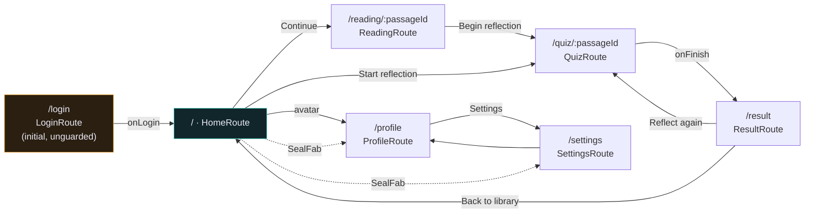

# Navigation

Route graph, `auto_route` setup, the auth guard, and the fade-slide transition.

**Contains §8** of the original plan. Section numbers are preserved so existing cross-references keep resolving.

> [Index](README.md) · [File map](07-file-map.md)

---

## 8. Navigation



```dart
// lib/app/router/app_router.dart
@AutoRouterConfig(replaceInRouteName: 'Page|Screen,Route')
class AppRouter extends RootStackRouter {
  AppRouter(this._authBloc);

  final AuthBloc _authBloc;

  @override
  RouteType get defaultRouteType => const RouteType.material();

  @override
  List<AutoRoute> get routes => [
    AutoRoute(path: '/login', page: LoginRoute.page),
    AutoRoute(path: '/', page: HomeRoute.page, guards: [AuthGuard(_authBloc)]),
    AutoRoute(path: '/reading/:passageId', page: ReadingRoute.page, guards: [AuthGuard(_authBloc)]),
    AutoRoute(path: '/quiz/:passageId', page: QuizRoute.page, guards: [AuthGuard(_authBloc)]),
    AutoRoute(path: '/result', page: ResultRoute.page, guards: [AuthGuard(_authBloc)]),
    AutoRoute(path: '/profile', page: ProfileRoute.page, guards: [AuthGuard(_authBloc)]),
    AutoRoute(path: '/settings', page: SettingsRoute.page, guards: [AuthGuard(_authBloc)]),
    RedirectRoute(path: '*', redirectTo: '/'),
  ];
}
```

**Screen transition (fade + 8px slide):** apply globally via `defaultRouteType` → `RouteType.custom(transitionsBuilder: EvaMotion.fadeSlide, duration: EvaMotion.screenDuration)`, where `fadeSlide` is `FadeTransition` + `SlideTransition`. Use `Offset(0, 8 / constraints.maxHeight)` to honour the 8px spec exactly rather than a fixed 4% fraction.

**Auth guard:**

```dart
class AuthGuard extends AutoRouteGuard {
  AuthGuard(this._auth);
  final AuthBloc _auth;

  @override
  void onNavigation(NavigationResolver resolver, StackRouter router) {
    if (_auth.state is AuthAuthenticated) {
      resolver.resolveNext(true, reevaluateNext: false);
    } else {
      resolver.redirectUntil(LoginRoute(
        onResult: (didLogin) => resolver.resolveNext(didLogin, reevaluateNext: false),
      ));
    }
  }
}
```

Wire `reevaluateListenable: ReevaluateListenable.stream(authBloc.stream)` in `MaterialApp.router` so logging out re-evaluates the whole stack.

`AppRouter` takes `AuthBloc` by constructor, so it must be registered in `di/modules/core_module.dart` as a factory that reads the bloc from the `getIt` instance — do not instantiate it as a field in `app.dart`, or a second `AppRouter` with a stale bloc will exist alongside the injected one.

**FAB dock (fixes #7):** `FabDockItem` takes a real `onPressed` callback, not a nullable route id. A dead item is now unrepresentable rather than a runtime `null` check.

---
