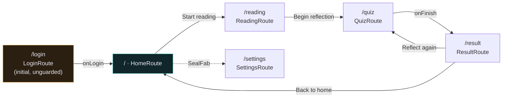

# Navigation

Route graph, `auto_route` setup, the auth guard, and the fade-slide transition.

**Contains §8** of the original plan. Section numbers are preserved so existing cross-references keep resolving.

> [Index](README.md) · [File map](07-file-map.md) · [Authority](../agents/AGENT_CONTEXT.md)

---

## 8. Navigation

**Six routes.** See [AGENT_CONTEXT](../agents/AGENT_CONTEXT.md) §2 for the locked screen list.

| Route | Screen | Guarded | Data source |
| --- | --- | --- | --- |
| `/login` | Onboarding + login | **no** — the entry point | `FakeAuthRepository` |
| `/` | Home — greeting, streak flame, today's-reading panel | yes | **API** |
| `/reading` | Reading sanctuary, EN and AR, zero chrome | yes | **API** |
| `/quiz` | Quiz with instant per-question feedback | yes | **API** |
| `/result` | Result — score, streak, stat tiles | yes | API (submit response) |
| `/settings` | Appearance, reading, about | yes | local |
| `*` | `RedirectRoute` → `/` | — | — |

**No route carries an id path parameter.** Two independent reasons, and both must hold:

1. **There is no library to browse.** Nothing in the app can produce a passage id to pass along, so the passage is always *today's*. The reading screen calls `GET /readings/today/{lang}` and the quiz calls the same endpoint.
2. **The backend has no `GET /readings/:id`.** Even with an id in hand there would be nothing to resolve it against. This is why the quiz **re-fetches** `GET /readings/today/{lang}` on entry instead of reading cached state: only a fresh response carries trustworthy `already_answered` flags, and a stale `false` is discovered as an HTTP `409` at submit time ([AGENT_CONTEXT](../agents/AGENT_CONTEXT.md) §5, trap 3).

> **Cut.** The profile screen and its route were dropped — Library and Profile are out of scope ([AGENT_CONTEXT](../agents/AGENT_CONTEXT.md) §2, decision 1). Consequences in this file: the `AppTopBar` avatar tap now opens `/settings`, the settings screen's back target is `/` instead of the profile screen, and the FAB dock is down to two items (Settings, Language).



```dart
// lib/app/router/app_router.dart
@AutoRouterConfig(replaceInRouteName: 'Page|Screen,Route')
class AppRouter extends RootStackRouter {
  AppRouter(this._authBloc);

  final AuthBloc _authBloc;

  @override
  RouteType get defaultRouteType => const RouteType.material();

  @override
  List<AutoRoute> get routes => [
    AutoRoute(path: '/login', page: LoginRoute.page),
    AutoRoute(path: '/', page: HomeRoute.page, guards: [AuthGuard(_authBloc)]),
    AutoRoute(path: '/reading', page: ReadingRoute.page, guards: [AuthGuard(_authBloc)]),
    AutoRoute(path: '/quiz', page: QuizRoute.page, guards: [AuthGuard(_authBloc)]),
    AutoRoute(path: '/result', page: ResultRoute.page, guards: [AuthGuard(_authBloc)]),
    AutoRoute(path: '/settings', page: SettingsRoute.page, guards: [AuthGuard(_authBloc)]),
    RedirectRoute(path: '*', redirectTo: '/'),
  ];
}
```

`RedirectRoute(path: '*')` stays last and still sends unknown paths to `/`. Note that it is **unguarded**, so a bad path bounces through `AuthGuard` on `/` and lands on the login screen when there is no session — which is the intended behaviour.

**Screen transition (fade + 8px slide):** apply globally via `defaultRouteType` → `RouteType.custom(transitionsBuilder: EvaMotion.fadeSlide, duration: EvaMotion.screenDuration)`, where `fadeSlide` is `FadeTransition` + `SlideTransition`. Use `Offset(0, 8 / constraints.maxHeight)` to honour the 8px spec exactly rather than a fixed 4% fraction.

**Auth guard:**

```dart
class AuthGuard extends AutoRouteGuard {
  AuthGuard(this._auth);
  final AuthBloc _auth;

  @override
  void onNavigation(NavigationResolver resolver, StackRouter router) {
    if (_auth.state is AuthAuthenticated) {
      resolver.resolveNext(true, reevaluateNext: false);
    } else {
      resolver.redirectUntil(LoginRoute(
        onResult: (didLogin) => resolver.resolveNext(didLogin, reevaluateNext: false),
      ));
    }
  }
}
```

> **The guard is a client-side gate over a fake session, and nothing more.** `FakeAuthRepository` returns a seeded `AuthSession` that the app persists locally (`shared_preferences`); `AuthGuard` reads that persisted state. The backend has **no auth endpoint** and performs **no server validation** — every route it does expose is reachable by anyone who sets the right headers, and it never enforces `X-User-Role` ([AGENT_CONTEXT](../agents/AGENT_CONTEXT.md) §5). So the guard protects nothing but navigation flow. Do not add role checks against it, and do not treat a redirect as a security boundary.

Wire `reevaluateListenable: ReevaluateListenable.stream(authBloc.stream)` in `MaterialApp.router` so logging out re-evaluates the whole stack.

**`AppRouter` is a `getIt` factory, never a field.** It takes `AuthBloc` by constructor, so it must be registered in `di/modules/core_module.dart` as a factory that reads the bloc from the `getIt` instance — do not instantiate it as a field in `app.dart`, or a second `AppRouter` with a stale bloc will exist alongside the injected one.

**FAB dock (fixes #7):** `FabDockItem` takes a real `onPressed` callback, not a nullable route id. A dead item is now unrepresentable rather than a runtime `null` check. With the profile screen cut the dock is down to two items — Settings and Language — and the Language item is still the open question tracked in [§15](10-open-decisions.md#15-open-decisions) decision #2.

---
