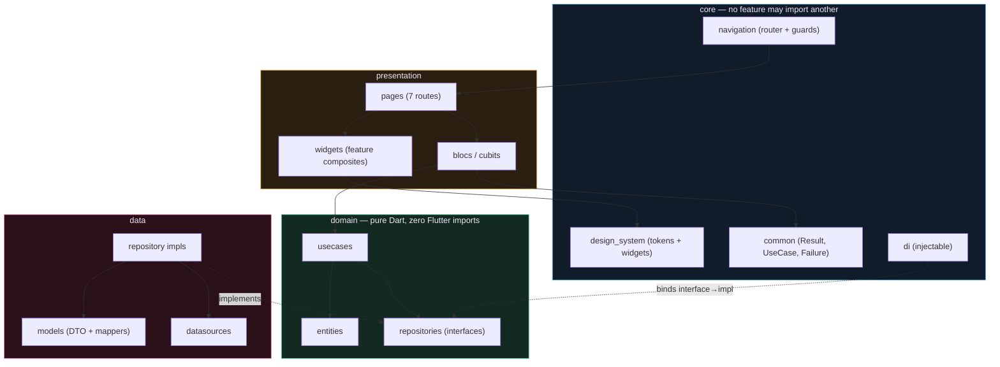
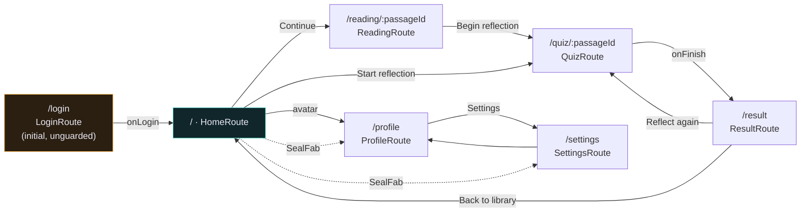
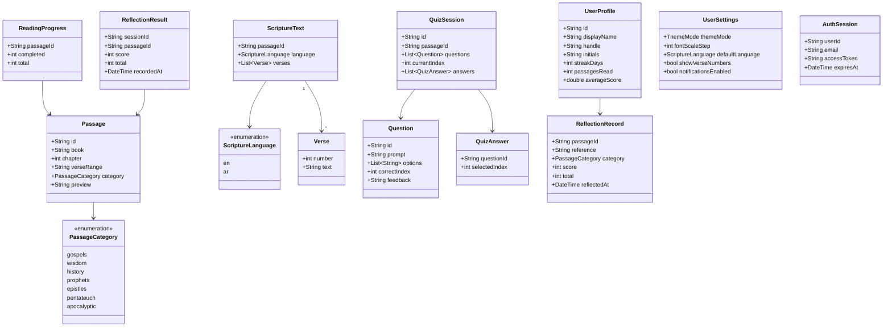

# Evangelion — Widget & Clean Architecture Plan

> ## ⚠️ SUPERSEDED — do not implement from this file
>
> This is the **original single-file plan (1,531 lines) as it stood immediately before the split.** It is kept only as a historical record of the review and revision that produced the current plan set.
>
> It is **known-stale in one specific way**: the two tables of defects (§2 *Verified defects* and §12 *Defects to fix during the port*) were separate here, and were merged into a single 6-column table in the split. Several cross-references here also point at `#anchor` fragments that are meaningless outside this file.
>
> **Use [`../README.md`](../README.md) and the ten numbered files beside this directory instead.** The content is identical apart from that merge and the file-level cross-reference rewrites.
>
> What this file still records well: the reasoning and narrative. The split files carry the same prose.

---

> **For agentic workers:** REQUIRED SUB-SKILL: use `subagent-driven-development` (recommended) or `executing-plans` to implement this plan phase-by-phase. Every phase ends with `flutter analyze` clean and its widget tests green before the next phase starts.

**Goal:** Port the Figma Make prototype in `eva/` (React + Tailwind) into a production Flutter app as ~41 reusable widgets over a feature-first clean architecture, fixing the 12 defects catalogued in [§12](#12-defects-to-fix-during-the-port).

**Architecture:** Feature-first clean architecture. Each of `auth`, `library`, `reading`, `quiz`, `profile` owns a `domain` layer (pure Dart, zero Flutter imports), a `data` layer (models, datasources, repository implementations), and a `presentation` layer (BLoC/Cubit, pages, feature widgets). A shared `core/` holds the design system, common contracts, navigation, and DI. Dependency direction is strictly inward: `presentation → domain ← data`. No feature may import another feature; shared UI lives in `core/design_system`.

**Tech Stack:** Flutter 3.47.4 / Dart 3.13.3 · `flutter_bloc 9.1.1` · `equatable 3.0.0` · `auto_route 11.2.0` + `auto_route_generator 10.6.0` · `build_runner 2.16.1` · `get_it 9.3.0` + `injectable 3.0.0` · `dio 5.11.1` · `google_fonts 9.0.0` · `mocktail 1.0.5` · `bloc_test 10.0.0`

**Decisions locked:** (1) Port the *built* React code's visual language — dark glassmorphic, DM Sans, glows, `NeuralBackground` — **not** the flat warm-paper brief in `eva/src/imports/pasted_text/pasted-attachment.txt`. (2) BLoC/Cubit + `auto_route`. (3) Full clean architecture, all layers.

---

## Table of contents

1. [Source analysis](#1-source-analysis)
2. [Verified defects](#2-verified-defects)
3. [Duplication inventory](#3-duplication-inventory)
4. [Architecture](#4-architecture)
5. [Design system](#5-design-system)
6. [Widget inventory](#6-widget-inventory)
7. [File map](#7-file-map)
8. [Navigation](#8-navigation)
9. [Domain model](#9-domain-model)
10. [Build phases](#10-build-phases)
11. [Test strategy](#11-test-strategy)
12. [Defects to fix during the port](#12-defects-to-fix-during-the-port)
13. [Performance](#13-performance)
14. [Accessibility](#14-accessibility)

---

## 1. Source analysis

`eva/` is a **Figma Make React prototype** — a design reference, not portable source. Structure:

| File | Role |
| --- | --- |
| `src/main.tsx` | Entrypoint, wraps app in `ThemeProvider` |
| `src/App.tsx` | 390×844 phone frame + dev-only screen switcher (8 chips) + theme toggle |
| `src/contexts/theme.tsx` | `isDark: bool` + `toggle()`, writes `data-theme` on `<html>` |
| `src/components/ds.tsx` | 570 lines — "Evangelion DS": tokens + 13 widgets + 5 helpers |
| `src/screens/*.tsx` | 8 screens, 1:1 with the 8 Figma frames |
| `src/index.css` | CSS vars for both themes, 6 keyframe animations, Google Fonts import |

### 1.1 The prototype ships 13 widgets, and 6 more declared inside screens

`ds.tsx` exports **13** widgets — `NeuralBackground`, `ButtonPrimary`, `ButtonSecondary`, `ButtonText`, `Input`, `CategoryChip`, `ProgressBeads`, `PassageCard`, `QuizOption`, `StatTile`, `SettingsTile`, `TopBar`, `SealFAB` — plus 5 non-widget exports: `T` (token strings), `HEX`, `useHex()`, `rgba()`, `F` (font map). `ORB_CONFIGS` is module-private.

Screens declare **6** more components locally, none of them exported:

| Component | Declared at |
| --- | --- |
| `GoogleIcon` | `screens/LoginScreen.tsx:104` |
| `AppleIcon` | `screens/LoginScreen.tsx:115` |
| `GoldFleck` | `screens/QuizScreen.tsx:12` |
| `SunBurst` | `screens/ResultScreen.tsx:4` |
| `Toggle` | `screens/SettingsScreen.tsx:14` |
| `SectionLabel` | `screens/SettingsScreen.tsx:28` |

That accounts for 19 named components. The larger duplication is *unnamed* — repeated inline style blocks with no component boundary at all: the 44px back buttons, the sticky CTA, the Home hero, the category filter bar, the feedback banner, the journey rows. Those are the 13 patterns inventoried in [§3](#3-duplication-inventory), which is where most of the extraction work is.

### 1.2 Brief vs. built code diverge sharply

The brief mandates warm paper `#FBF7EF`, **Nunito** for UI, flat hairline cards, and bans gradients, blur/glass, and glows outright. The generated code went dark glassmorphic: canvas `#05081A`, **DM Sans**, 10 copies of `backdropFilter`, `0 0 80px` glows, and a full `NeuralBackground` (aurora gradients, hue-rotate orbs, noise grain) that appears nowhere in the brief.

This plan ports the built code. Two consequences to carry forward:

- The `NeuralBackground` is **load-bearing**, not decoration to be deleted. It is the app's identity and must be ported faithfully — but it is also the single worst performance offender (§13).
- The prototype's Arabic `Space Mono` bug (#2) is a direct consequence of the token table not matching the actual rendered text. The port must validate font/glyph coverage per script.

### 1.3 Two source-of-truth problems in the token system

`HEX` (`ds.tsx:32-43`) and the CSS vars (`index.css:6-37`) hold the same 24 values, maintained twice. `T` returns `var(--x)` strings, so the only way to derive an alpha variant is `useHex()` + `rgba(hex, a)` string concatenation. Every primitive therefore calls `useTheme()` *and* `useHex()` — two context lookups per widget, and consumers must remember which accessor to use.

**Resolution:** one `ThemeExtension<EvaColors>` per theme. `context.colors.ember` is a real `Color`, so `.withValues(alpha: 0.14)` replaces the `rgba()` hack outright. One lookup, compile-time safety, no string parsing.

---

## 2. Verified defects

All rows confirmed by reading the source or by grep against `eva/src`.

| # | Defect | Evidence | Impact |
| --- | --- | --- | --- |
| 1 | **Category filter is a no-op.** `cat` state only drives chip highlight; the 4 grid cards are hardcoded literals. | `HomeScreen.tsx:12,86,93-96` | Core feature appears to work, does nothing |
| 2 | **Arabic rendered in Space Mono.** Space Mono has no Arabic glyphs → tofu boxes in the metadata row and CTA caption. | `ReadingArScreen.tsx:35,86` | Broken RTL screen |
| 3 | **`NeuralBackground` calls `setMouse` every frame** via a `requestAnimationFrame` loop that never idles. | `ds.tsx:143-148` | Permanent 60fps React re-render of the whole background subtree |
| 4 | **7 of 12 design tokens are dead.** `T.surface`, `T.raised`, `T.line`, `T.ember`, `T.emberDeep`, `T.onEmber`, `T.ok` all have **0** usages; everything reads `HEX.*` instead. | grep: `T.surface:0 T.raised:0 T.line:0 T.ember:0 T.emberDeep:0 T.onEmber:0 T.ok:0` | Token drift; `T` is half-vestigial |
| 5 | **Dual source of truth** for 24 hex values. | `ds.tsx:32-43` vs `index.css:6-37` | Silent divergence risk |
| 6 | **`--orb-opacity` / `--aurora-opacity` declared then ignored.** | `index.css:18-19,35-36` vs `ds.tsx:159` | Dead config |
| 7 | **FAB "Language" item silently does nothing.** `screen: null` → closes the dock, navigates nowhere. | `ds.tsx:540,546` | Dead-end UI |
| 8 | **`Input` is `readOnly` and uncontrolled** — no `value`, `onChanged`, or `onSubmitted`. | `ds.tsx:303` | Login form is non-functional |
| 9 | **`minHeight: 844` hardcoded in 9 places.** | 9 occurrences across 8 screens | Breaks on every real device (SE, foldables, tablets) |
| 10 | **Login states are baked in.** Email focus and password error are literals, not state. | `LoginScreen.tsx:49-52` | Error handling unreachable |
| 11 | **`TopBar` hardcodes** streak `12`, avatar `MK`, wordmark `Evangelion`. | `ds.tsx:507,516,525` | Not data-driven |
| 12 | **Dev scaffolding ships as UI.** `App.tsx` screen switcher + `QuizScreen` "Frame A/B" toggle exist only to let the Figma agent preview states. | `App.tsx:70-84`, `QuizScreen.tsx:56-63` | Must not be ported |

**Consequence for the port:** defects 1, 8, 10, and 11 are all symptoms of the same root cause — no state layer. The BLoC layer fixes them by construction. Defects 3, 4, 5, 6 are symptoms of no design-system layer; the `ThemeExtension` fixes them by construction.

---

## 3. Duplication inventory

These are the patterns that must **not** be carried into Dart. Each is a candidate for a single reusable widget.

| Pattern | Copies | Where | New widget |
| --- | --- | --- | --- |
| Screen root scaffold (`flex:1` + canvas + column + `minHeight:844` + `NeuralBackground` + z-index ladder) | **8** | all screens | `NeuralScaffold` |
| Glass/blur surface (`rgba()` + `backdropFilter` + hairline + radius) | **10** | 7 in `ds.tsx` (`Input`, `PassageCard`, `QuizOption`, `StatTile`, `SettingsTile`, FAB dock item, FAB button) + 3 inline (Login form, Home hero, Profile journey) | `GlassSurface` |
| 44px icon button (back / chevron / close) | **5** | ReadingEn, ReadingAr, Quiz, Profile, Settings | `IconActionButton` |
| Reading control cluster (back + `Aa` + bookmark) | **2** | ReadingEn, ReadingAr | `ReadingControls` |
| Mono-caps pill button | **4 style defs / 14 rendered** | `App.tsx` theme toggle (1), `App.tsx` screen chips (1 def → 8), `QuizScreen` frame toggle (1 def → 2), FAB dock items (1 def → 3) | `EvaChip` |
| Segmented control | **3** | Profile theme, Settings theme, Settings language | `SegmentedControl<T>` |
| Reading EN vs AR screen body | **2 (~90%)** | `ReadingEnScreen`, `ReadingArScreen` | one `ReadingPage` |
| Passage drop-cap "I" | **2** | Home hero, `ReadingEnScreen` | `PassageDropCap` |
| Sticky CTA (fade gradient + button + caption) | **2** | `ReadingEnScreen`, `ReadingArScreen` | `StickyCta` |
| Hairline divider | **3** | Login "or", Reading ×2 | `HairlineDivider` |
| Streak flame icon | **2** | `TopBar`, `ResultScreen` | `StreakFlame` |
| Avatar badge (gradient circle + initials) | **2** | `TopBar`, `ProfileScreen` | `AvatarBadge` |
| Settings controls (toggle / slider / segmented) | **2** | `ProfileScreen`, `SettingsScreen` | `SettingsGroup` |

**Totals:** 4 widgets collapse **32 call sites** — `NeuralScaffold` 8 + `GlassSurface` 10 + `IconActionButton` 5 + `EvaButton` 9 (`ButtonPrimary` 6 + `ButtonSecondary` 1 + `ButtonText` 2). Beyond that: 2 reading screens → 1 page, 2 settings surfaces → 1 composable `SettingsGroup`, and the mono-caps pill's 4 style definitions → 1 `EvaChip`.

### 3.1 Patterns that do NOT earn a widget

A candidate is only worth a widget if two or more call sites need it *and* deleting the widget makes complexity reappear. Two candidates in an earlier draft of this plan failed that test and were demoted:

| Candidate | Call sites | Decision |
| --- | --- | --- |
| `EvaProgressBar` | **1** — the bar style (`height: 3`) exists only in `ds.tsx` `PassageCard`; the Home hero uses `ProgressBeads` (dots), not a bar | **Not a widget.** Becomes a private `_PassageProgress` inside `passage_card.dart`. One call site and no variation makes a public interface pure indirection. |
| `SectionLabel` vs `ScreenSectionHeader` | **3** — Home "Explore the library", Profile "Journey"/"Settings", Settings' four group labels | **One widget**, not two. `SectionLabel` (shared DS) and `ScreenSectionHeader` (feature-local) were the same idea split across two homes. Consolidated to `EvaSectionHeader` in Tier 1 with a `size` variant (`section` 16/700, `title` 17/800). |

**Not a glass surface:** `StickyCta` (`ReadingEnScreen.tsx:80-86`) and the Quiz feedback banner (`QuizScreen.tsx:104-112`) look similar but use a solid `linear-gradient` / flat `rgba(ok, 0.1)` fill with **no** `backdropFilter`. They are separate composites, not `GlassSurface` instances.

---

## 4. Architecture

### 4.1 Layer graph



### 4.2 Enforcement

- **Domain purity:** `features/*/domain/**` must not `import 'package:flutter/...'`. Enforce with a lint rule or a CI grep:

  ```bash
  ! grep -rn "package:flutter/" lib/features/*/domain/ || (echo "domain layer leaked Flutter" && exit 1)
  ```

- **Feature isolation:** `features/*/presentation` must not import another feature's `presentation`. Cross-feature navigation goes through `auto_route`; cross-feature data goes through `domain` interfaces.
- **No `setState` for business state.** `setState` is permitted only for ephemeral animation controllers inside a widget's own `State`.

### 4.3 Deep-module seams

Per the `codebase-design` vocabulary, four seams carry most of the leverage:

| Seam | Interface | What it hides | Payoff |
| --- | --- | --- | --- |
| `ThemeExtension<EvaColors>` | `context.colors.ember` | 24 hex values, 2 themes, alpha derivation | kills `useHex()` + `rgba()` at 60+ call sites |
| `GlassSurface` | `GlassSurface.tint(...)` / `.blur(...)` | `BackdropFilter` cost, hairline, radius, padding | 10 sites → 1 |
| `NeuralBackground` | `NeuralBackground(variant: NeuralVariant.home, tier: ...)` | `Ticker` lifecycle, hue-rotation matrix, orb config, perf tier | 8 scaffolds + 8 orb tables → 1 |
| `ReadingPage` | `ReadingPage(passageId:, language:)` | font, direction, alignment, verse markers, RTL chrome | 2 screens → 1 |

**One adapter means a hypothetical seam.** `NeuralVariant` is an enum, not a `Map<String, List<Orb>>` passed in from outside — no caller ever supplies a custom orb table, so there is no seam there, just a constant.

---

## 5. Design system

### 5.1 Tokens

Source of truth = the built React code (`HEX` in `ds.tsx`, mirrored in `index.css`).

**Dark**

| Token | Value | Replaces |
| --- | --- | --- |
| `canvas` | `#05081A` | `--canvas` |
| `surface` | `#0D1224` | `--surface` |
| `raised` | `#141A2E` | `--raised` |
| `ink` | `#EAE8F5` | `--ink` |
| `ink2` | `#8A8FAD` | `--ink2` |
| `ink3` | `#424669` | `--ink3` |
| `line` | `#1C2238` | `--line` |
| `ember` | `#E8A33D` | `--ember` |
| `emberDeep` | `#C77F1F` | `--ember-deep` |
| `onEmber` | `#0D0A04` | `--on-ember` |
| `ok` | `#4ECCA3` | `--ok` |
| `err` | `#FF6B6B` | `--err` |
| `orbOpacity` | `0.55` | `--orb-opacity` (was dead — wire it) |
| `auroraOpacity` | `0.18` | `--aurora-opacity` (was dead — wire it) |

**Light**

| Token | Value |
| --- | --- |
| `canvas` | `#F0EEFF` |
| `surface` | `#FFFFFF` |
| `raised` | `#E8E4FF` |
| `ink` | `#120E28` |
| `ink2` | `#5A5480` |
| `ink3` | `#9B97B8` |
| `line` | `#D5D0EF` |
| `ember` | `#D4891A` |
| `emberDeep` | `#B56C0C` |
| `onEmber` | `#FFF8EE` |
| `ok` | `#1A8C6A` |
| `err` | `#D63B3B` |
| `orbOpacity` | `0.18` |
| `auroraOpacity` | `0.10` |

**Sticker palette** (decorative only — chips, dots, celebration): `sky #7CC4F0` · `lavender #B79CF0` · `pink #F58FC4` · `coral #F4836B` · `teal #4EC9BD` · `leaf #7FC96B` · `sun #F5C84C`

**All 12 tokens ship.** The 7 dead tokens (§2 #4) are wired to their real consumers rather than deleted — `surface`/`raised` become the base layers of `GlassSurface`; `line` becomes the hairline colour; `onEmber` becomes `EvaButton.primary`'s foreground; `emberDeep` is the pressed fill; `ok`/`err` are the quiz/feedback semantic pair.

### 5.2 Typography

Five families, mapped to `TextTheme` slots plus scripture-specific styles (scripture has no Material slot).

| Role | Family | Source |
| --- | --- | --- |
| `display` | Cormorant Garamond 400/500/600/700 + italics | `F.display` |
| `scripture` | EB Garamond 400/500 + italic | `F.scripture` |
| `arabic` | Amiri 400/700 + italic | `F.arabic` |
| `ui` | DM Sans 300–800 + italics | `F.ui` |
| `mono` | Space Mono 400/700 + italic | `F.mono` |

Wire via `google_fonts` (`GoogleFonts.cormorantGaramondTextTheme` etc.) with fonts bundled at build time so first paint is not blocked on a network fetch.

**Font-size steps** map the Settings slider (`1..5`) onto a `TextScaler`:

```dart
TextScaler evaScalerFor(int step) => switch (step) {
  1 => const TextScaler.linear(0.90),
  2 => const TextScaler.linear(0.95),
  3 => const TextScaler.linear(1.00),
  4 => const TextScaler.linear(1.10),
  _ => const TextScaler.linear(1.22),
};
```

**Glyph-coverage guard (fixes #2):** `mono` must never be applied to Arabic. Assert this in a widget test — see [§11](#11-test-strategy).

### 5.3 Spacing, radii, motion

- **Spacing (4px base):** `4 · 8 · 12 · 16 · 20 · 24 · 32 · 40` → `EvaSpacing.xs/sm/md/lg/xl/xxl/xxxl/huge`. Screen horizontal padding = 20; card padding = 20.
- **Radii:** buttons `14` · inputs `14` · cards `18` · quiz options `18` · chips `999` (`Radius.circular(999)`) · hero panel `24` · glass form `28`
- **Motion** (`EvaMotion`):

| Token | Duration | Curve |
| --- | --- | --- |
| `fast` | 150ms | `easeOut` |
| `base` | 200ms | `easeOut` |
| `screen` | 250ms | `easeOutCubic` |
| `fleck` | 2000ms | `alternate` |
| `orbFloat` | 14–28s per orb | `easeInOut` |
| `orbHue` | 7–14s per orb | `linear` |
| `aurora` | 14s | `easeInOut` |

All curves are ease-out. No bounce, no spring — matching the brief's motion rule.

### 5.4 Token access

```dart
// lib/core/design_system/tokens/eva_colors.dart
@immutable
class EvaColors extends ThemeExtension<EvaColors> {
  const EvaColors({
    required this.canvas, required this.surface, required this.raised,
    required this.ink, required this.ink2, required this.ink3, required this.line,
    required this.ember, required this.emberDeep, required this.onEmber,
    required this.ok, required this.err,
    required this.orbOpacity, required this.auroraOpacity,
    required this.glassFill, required this.glassBorder,
    required this.glassShadow, required this.sticker,
  });

  final Color canvas, surface, raised, ink, ink2, ink3, line;
  final Color ember, emberDeep, onEmber, ok, err;
  final double orbOpacity, auroraOpacity;
  final Color glassFill, glassBorder, glassShadow;
  final Map<StickerSlot, Color> sticker;

  @override
  EvaColors copyWith({
    Color? canvas, Color? surface, Color? raised,
    Color? ink, Color? ink2, Color? ink3, Color? line,
    Color? ember, Color? emberDeep, Color? onEmber,
    Color? ok, Color? err,
    double? orbOpacity, double? auroraOpacity,
    Color? glassFill, Color? glassBorder, Color? glassShadow,
    Map<StickerSlot, Color>? sticker,
  }) => EvaColors(
    canvas: canvas ?? this.canvas, surface: surface ?? this.surface,
    raised: raised ?? this.raised, ink: ink ?? this.ink,
    ink2: ink2 ?? this.ink2, ink3: ink3 ?? this.ink3,
    line: line ?? this.line, ember: ember ?? this.ember,
    emberDeep: emberDeep ?? this.emberDeep,
    onEmber: onEmber ?? this.onEmber, ok: ok ?? this.ok,
    err: err ?? this.err, orbOpacity: orbOpacity ?? this.orbOpacity,
    auroraOpacity: auroraOpacity ?? this.auroraOpacity,
    glassFill: glassFill ?? this.glassFill,
    glassBorder: glassBorder ?? this.glassBorder,
    glassShadow: glassShadow ?? this.glassShadow,
    sticker: sticker ?? this.sticker,
  );

  @override
  EvaColors lerp(EvaColors? other, double t) {
    if (other == null) return this;
    Color c(Color a, Color b) => Color.lerp(a, b, t)!;
    double d(double a, double b) => a + (b - a) * t;
    return EvaColors(
      canvas: c(canvas, other.canvas), surface: c(surface, other.surface),
      raised: c(raised, other.raised), ink: c(ink, other.ink),
      ink2: c(ink2, other.ink2), ink3: c(ink3, other.ink3),
      line: c(line, other.line), ember: c(ember, other.ember),
      emberDeep: c(emberDeep, other.emberDeep),
      onEmber: c(onEmber, other.onEmber), ok: c(ok, other.ok),
      err: c(err, other.err),
      orbOpacity: d(orbOpacity, other.orbOpacity),
      auroraOpacity: d(auroraOpacity, other.auroraOpacity),
      glassFill: c(glassFill, other.glassFill),
      glassBorder: c(glassBorder, other.glassBorder),
      glassShadow: c(glassShadow, other.glassShadow),
      sticker: {
        for (final slot in StickerSlot.values)
          slot: c(sticker[slot]!, other.sticker[slot]!),
      },
    );
  }
}

extension EvaColorsX on BuildContext {
  EvaColors get colors => Theme.of(this).extension<EvaColors>()!;
}
```

`glassFill` / `glassBorder` / `glassShadow` are the three values the React prototype recomputes inline in 10 places:

- dark: fill `Color(0x0DFFFFFF)` (≈`rgba(255,255,255,0.05)`) · border `Color(0x14FFFFFF)` (≈`0.08`) · shadow `Color(0x59000000)` (≈`0.35`)
- light: fill `Color(0x0A000000)` (≈`rgba(0,0,0,0.03)`) · border `Color(0x14000000)` (≈`0.07`) · shadow `Color(0x1F120E28)` (≈`rgba(18,14,40,0.12)`, `ProfileScreen.tsx:15`)

The light shadow colour is `#120E28` — the built code's light `ink`. Do **not** substitute the brief's `#221C15`; that value belongs to the discarded warm-paper palette (§1.2).

`sticker` is a `Map<StickerSlot, Color>` rather than free-floating hex so `PassageCategory` → colour becomes a type-checked lookup.

---

## 6. Widget inventory

41 widgets across 4 tiers (42 counting `BrandLockup`, added after review; `EvaProgressBar` was demoted to a private widget and `SectionLabel` merged into `EvaSectionHeader` — see §3.1). Each entry gives the widget's public constructor; the consolidating prototype source is stated in [§3](#3-duplication-inventory).

### Tier 0 — Foundations (no widgets)

| File | Contents |
| --- | --- |
| `tokens/eva_colors.dart` | `EvaColors`, `EvaColorsX.colors`, `EvaDark`, `EvaLight` |
| `tokens/eva_typography.dart` | `EvaTypography` (scripture AR/EN + display + mono caps) |
| `tokens/eva_spacing.dart` | `EvaSpacing` |
| `tokens/eva_radii.dart` | `EvaRadii` |
| `tokens/eva_motion.dart` | `EvaMotion` |
| `tokens/sticker_palette.dart` | `StickerSlot` enum, `StickerPalette` |
| `tokens/eva_fonts.dart` | `EvaFonts`, `evaScalerFor(int)` |
| `theme/eva_theme.dart` | `EvaTheme.dark()`, `EvaTheme.light()` |

### Tier 1 — Primitives

```dart
// 1. NeuralScaffold — the screen root. 8 copies → 1.
class NeuralScaffold extends StatelessWidget {
  const NeuralScaffold({
    required this.variant,
    required this.child,
    this.scrollable = false,
    this.padding = const EdgeInsets.symmetric(horizontal: EvaSpacing.lg),
    this.bottomFade = false,   // reading/quiz sticky-CTA scrim
    super.key,
  });
  final NeuralVariant variant;
  final Widget child;
  final bool scrollable;
  final EdgeInsets padding;
  final bool bottomFade;
}

// 2. GlassSurface — the one true surface. 10 blur sites → 1.
enum GlassTier { tint, blur }

class GlassSurface extends StatelessWidget {
  const GlassSurface({
    required this.child,
    this.tier = GlassTier.tint,
    this.radius = EvaRadii.card,      // 18
    this.padding = const EdgeInsets.all(EvaSpacing.lg),
    this.border = true,
    this.onTap,
    this.semanticLabel,
    super.key,
  });
}

// 3. EvaButton — 3 components → 1. 9 call sites.
enum EvaButtonVariant { primary, secondary, ghost }

class EvaButton extends StatelessWidget {
  const EvaButton({
    required this.label,
    this.onPressed,
    this.variant = EvaButtonVariant.primary,
    this.icon,
    this.trailingChevron = false,
    this.expanded = true,
    this.height = 52,
    super.key,
  });
}

// 4. EvaTextField — fixes #8, #10.
class EvaTextField extends StatefulWidget {
  const EvaTextField({
    required this.label,
    required this.controller,
    this.errorText,
    this.obscureText = false,
    this.keyboardType,
    this.textInputAction,
    this.onSubmitted,
    this.trailing,
    super.key,
  });
}

// 5. EvaChip — CategoryChip + 4 inline pill variants → 1.
enum EvaChipVariant { filter, category, static }

class EvaChip extends StatelessWidget {
  const EvaChip({
    required this.label,
    this.variant = EvaChipVariant.filter,
    this.color,              // sticker colour
    this.selected = false,
    this.onSelected,
    this.leadingDot = true,
    super.key,
  });
}

// 6. ProgressBeads
class ProgressBeads extends StatelessWidget {
  const ProgressBeads({required this.total, required this.completed, required this.current, super.key});
  final int total, completed, current;
}

// 7. PassageCard's private progress bar — NOT a public widget.
//    One call site and no variation (see §3.1), so it stays private to
//    the file that owns it. Kept here only to show the geometry.
class _PassageProgress extends StatelessWidget {
  const _PassageProgress({required this.value, required this.total, super.key});
  final int value, total;

  @override
  Widget build(BuildContext context) {
    final colors = context.colors;
    return Column(
      crossAxisAlignment: CrossAxisAlignment.start,
      children: [
        ClipRRect(
          borderRadius: BorderRadius.circular(999),
          child: SizedBox(
            height: 3,
            child: LinearProgressIndicator(
              value: total == 0 ? 0 : value / total,
              backgroundColor: colors.ink.withValues(alpha: 0.10),
              valueColor: AlwaysStoppedAnimation(
                LinearGradient(
                  colors: [colors.ember, context.stickers.sun],
                ).createShader(const Rect.fromLTWH(0, 0, 1, 3)),
              ),
            ),
          ),
        ),
        const SizedBox(height: 5),
      ],
    );
  }
}

// 8. StatTile · 9. SettingsTile · 10. SettingsGroup
class StatTile extends StatelessWidget {
  const StatTile({required this.value, required this.label, super.key});
}
class SettingsTile extends StatelessWidget {
  const SettingsTile({required this.title, required this.trailing, this.onTap, super.key});
}
class SettingsGroup extends StatelessWidget {
  const SettingsGroup({required this.label, required this.children, super.key});
}

// 11. EvaSectionHeader — consolidates the former `SectionLabel`
//     (shared DS) and `ScreenSectionHeader` (feature-local) into one
//     widget with a size variant. 3 call sites: Home, Profile, Settings.
enum EvaSectionHeaderSize { title, section }

class EvaSectionHeader extends StatelessWidget {
  const EvaSectionHeader({
    required this.label,
    this.size = EvaSectionHeaderSize.section,
    this.trailing,
    super.key,
  });
  final String label;
  final EvaSectionHeaderSize size;
  final Widget? trailing;
}

// 12. SegmentedControl<T> — 3 copies → 1. Generic so ThemeMode and
//     ScriptureLanguage both work without a second widget.
class SegmentedControl<T> extends StatelessWidget {
  const SegmentedControl({
    required this.values,
    required this.selected,
    required this.labelOf,
    required this.onChanged,
    super.key,
  });
  final List<T> values;
  final T selected;
  final String Function(T) labelOf;
  final ValueChanged<T> onChanged;
}

// 13. EvaToggle · 14. FontSizeStepper · 15. IconActionButton
//     (6 copies: back ×4, close, bookmark, Aa)
class EvaToggle extends StatelessWidget {
  const EvaToggle({required this.value, required this.onChanged, super.key});
}
class FontSizeStepper extends StatelessWidget {
  const FontSizeStepper({required this.step, required this.onChanged, super.key});
}
class IconActionButton extends StatelessWidget {
  const IconActionButton({
    required this.icon,
    required this.tooltip,   // also the Semantics label — fixes §14
    this.onPressed,
    this.size = 44,
    super.key,
  });
}

// 16. HairlineDivider — with optional centred label (Login's "or")
class HairlineDivider extends StatelessWidget {
  const HairlineDivider({this.label, this.color, super.key});
}

// 17. TextLink — replaces 3 inline "Create account" / "Edit" / "Sign out"
class TextLink extends StatelessWidget {
  const TextLink({required this.label, this.onPressed, this.color, super.key});
}

// 18. EmptyState · 19. ErrorView — the prototype has neither
class EmptyState extends StatelessWidget {
  const EmptyState({required this.icon, required this.title, required this.message, this.action, super.key});
}
class ErrorView extends StatelessWidget {
  const ErrorView({required this.message, this.onRetry, super.key});
}
```

### Tier 2 — Ambient & decorative

```dart
// 20. NeuralBackground — the identity layer. CustomPaint + Ticker. Never setState-per-frame.
enum NeuralVariant { login, home, readingEn, readingAr, quiz, result, profile, settings }
enum NeuralTier { high, mid, low }   // low disables orbs + aurora entirely

class NeuralBackground extends StatelessWidget {
  const NeuralBackground({required this.variant, super.key});
  final NeuralVariant variant;
  // Reads EvaNeuralMotion from NeuralMotionScope. Deliberately not a
  // parameter — see §13.2.
}

// 21. GoldFlecks — QuizScreen's 4 positioned flecks
class GoldFlecks extends StatelessWidget {
  const GoldFlecks({required this.offsets, this.dense = false, super.key});
  final List<Offset> offsets;   // in logical px from the parent's top-left
}

// 22. StreakFlame · 23. SunBurst (CustomPaint) · 24. AvatarBadge
class StreakFlame extends StatelessWidget { const StreakFlame({this.size = 18, super.key}); }
class SunBurst extends StatelessWidget { const SunBurst({this.size = 96, super.key}); }
class AvatarBadge extends StatelessWidget {
  const AvatarBadge({required this.initials, this.size = 32, this.onTap, super.key});
};

// 25. PassageDropCap — 2 copies; LTR + RTL aware via WidgetSpan
class PassageDropCap extends StatelessWidget {
  const PassageDropCap({
    required this.letter,
    this.language = ScriptureLanguage.en,
    this.lines = 3,
    super.key,
  });
}

// 26. SealMonogram — the "E" in Login + FAB
class SealMonogram extends StatelessWidget { const SealMonogram({this.size = 60, super.key}); }
```

### Tier 3 — Feature composites

```dart
// 27. AppTopBar — fixes #11. Fully data-driven.
class AppTopBar extends StatelessWidget {
  const AppTopBar({
    required this.wordmark,
    required this.streakDays,
    required this.initials,
    this.onAvatarTap,
    super.key,
  });
}

// 27b. BrandLockup — the Login hero block (LoginScreen.tsx:17-35):
//      SealMonogram + wordmark + tagline. The only unmapped prototype
//      composition in the original plan; added after review.
class BrandLockup extends StatelessWidget {
  const BrandLockup({
    required this.wordmark,
    required this.tagline,
    this.sealSize = 60,
    super.key,
  });
  final String wordmark, tagline;
  final double sealSize;
}

// 28. SealFab + 29. FabDockItem — fixes #7. Items are route-driven, never null-screen.
class SealFab extends StatefulWidget {
  const SealFab({required this.actions, super.key});
  final List<FabDockItem> actions;
}
class FabDockItem {
  const FabDockItem({required this.label, required this.onPressed});
}

// 30. ContinueReadingPanel — HomeScreen's 45-line hero
class ContinueReadingPanel extends StatelessWidget {
  const ContinueReadingPanel({
    required this.reference, required this.preview, required this.excerpt,
    required this.completed, required this.total,
    required this.onContinue, required this.onReflect,
    super.key,
  });
}

// 31. CategoryFilterBar — horizontal scrolling, real filtering (fixes #1)
class CategoryFilterBar extends StatelessWidget {
  const CategoryFilterBar({
    required this.categories, required this.selected, required this.onSelected,
    super.key,
  });
}

// 32. PassageCard
class PassageCard extends StatelessWidget {
  const PassageCard({
    required this.reference, required this.preview, required this.category,
    required this.completed, required this.total,
    this.onTap,
    super.key,
  });
}

// 33. QuizOptionCard — 4 states
enum QuizOptionState { idle, selected, correct, incorrect }
class QuizOptionCard extends StatelessWidget {
  const QuizOptionCard({
    required this.letter, required this.text, required this.state,
    this.onTap, this.enabled = true, super.key,
  });
}

// 34. StickyCta — 2 copies
class StickyCta extends StatelessWidget {
  const StickyCta({required this.label, required this.caption, required this.onPressed, super.key});
}

// 35. ScriptureBlock + 36. ScriptureVerse — LTR + RTL from one widget
class ScriptureBlock extends StatelessWidget {
  const ScriptureBlock({required this.verses, required this.language, this.showVerseNumbers = true, super.key});
}
class ScriptureVerse extends StatelessWidget {
  const ScriptureVerse({required this.verse, required this.language, this.dropCap = false, this.showNumber = true, super.key});
};

// 37. ReadingControls (back + Aa + bookmark, direction-aware) — 2 copies
// 38. ScriptureMetadataRow (with gold flecks) — 2 copies
class ReadingControls extends StatelessWidget {
  const ReadingControls({required this.language, this.onBack, this.onFontSize, this.onBookmark, this.bookmarked = false, super.key});
}

// 39. QuizHeader (X + beads + spacer) · 40. FeedbackBanner (ok/err variants)
class QuizHeader extends StatelessWidget {
  const QuizHeader({required this.total, required this.completed, required this.current, this.onExit, super.key});
}
class FeedbackBanner extends StatelessWidget {
  const FeedbackBanner({required this.tone, required this.message, super.key});
}

// 41. JourneyTimeline + JourneyRow
class JourneyTimeline extends StatelessWidget {
  const JourneyTimeline({required this.records, super.key});
}
```

**Tier 3 continues into `features/*/presentation/widgets/`** (feature-local composites, not part of the shared DS): `SocialAuthButton`, `GoogleMark`, `AppleMark`, `ResultScore`, `StreakPill`, `StatRow`.

### Widget dependency graph

```mermaid
graph TD
    subgraph T1["Tier 1 — primitives"]
        NS["NeuralScaffold"]; GS["GlassSurface"]; EB["EvaButton"]; TF["EvaTextField"]
        CH["EvaChip"]; PB2["ProgressBeads"]; PBar["_PassageProgress (private)"]; ST["StatTile"]
        SH["EvaSectionHeader"]
        SET["SettingsTile / SettingsGroup"]; SC["SegmentedControl&lt;T&gt;"]
        TG["EvaToggle"]; FS["FontSizeStepper"]; IAB["IconActionButton"]
        HD["HairlineDivider"]; TL["TextLink"]; ES["EmptyState / ErrorView"]
    end
    subgraph T2["Tier 2 — ambient"]
        NB["NeuralBackground"]; GF["GoldFlecks"]; SF["StreakFlame"]
        SB["SunBurst"]; AB["AvatarBadge"]; DC["PassageDropCap"]; SM["SealMonogram"]
    end
    subgraph T3["Tier 3 — feature composites"]
        TB["AppTopBar"]; FAB["SealFab"]; CRP["ContinueReadingPanel"]
        CFB["CategoryFilterBar"]; PC["PassageCard"]; QOC["QuizOptionCard"]
        SCTA["StickyCta"]; SBK["ScriptureBlock"]; RCTR["ReadingControls"]
        QH["QuizHeader"]; FB["FeedbackBanner"]; JT["JourneyTimeline"]
    end

    NS --> NB
    GS --> NB
    T2 --> T1
    T3 --> T2
    T3 --> T1
    PC --> CH
    PC --> PBar
    CRP --> PB2
    CRP --> DC
    CRP --> EB
    CFB --> CH
    SBK --> DC
    SCTA --> EB
    QH --> PB2
    QOC --> GF
    FB --> SF
    TB --> SF
    TB --> AB
    JT --> AB
    SET --> SC
    SET --> TG
    SET --> FS

    style T1 fill:#2a1f10,stroke:#E8A33D,color:#EAE8F5
    style T2 fill:#1f132a,stroke:#B79CF0,color:#EAE8F5
    style T3 fill:#10262a,stroke:#4EC9BD,color:#EAE8F5
```



---

## 7. File map

```
lib/
  main.dart                                   # bootstrap: DI, fonts, runApp
  app/
    app.dart                                  # MaterialApp.router + theme + locale
    router/
      app_router.dart                         # @AutoRouterConfig RootStackRouter
      guards/auth_guard.dart                  # AutoRouteGuard + reevaluateListenable
    di/
      injection.dart                          # @InjectableInit configureDependencies()
      modules/
        core_module.dart
        auth_module.dart
        library_module.dart
        reading_module.dart
        quiz_module.dart
        profile_module.dart

  core/
    design_system/
      tokens/
        eva_colors.dart  eva_typography.dart  eva_spacing.dart
        eva_radii.dart   eva_motion.dart      eva_elevations.dart
        sticker_palette.dart  eva_fonts.dart
      theme/
        eva_theme.dart  eva_theme_dark.dart  eva_theme_light.dart
      effects/
        neural_background.dart
        neural_motion.dart                    # the shared 3-controller bundle
        glass_surface.dart
        gold_flecks.dart
        hue_rotate_matrix.dart                # hue matrix for ColorFilter
      widgets/
        neural_scaffold.dart  glass_surface.dart  eva_button.dart
        eva_text_field.dart    eva_chip.dart      progress_beads.dart
        eva_progress_bar.dart  stat_tile.dart     settings_tile.dart
        settings_group.dart    segmented_control.dart  eva_toggle.dart
        font_size_stepper.dart icon_action_button.dart hairline_divider.dart
        text_link.dart         empty_state.dart   error_view.dart
        avatar_badge.dart      streak_flame.dart  sun_burst.dart
        passage_drop_cap.dart  seal_monogram.dart
      barrel.dart                            # single import surface
    common/
      result.dart                             # Result<T>, Failure
      usecase.dart                            # UseCase<In,Out>, NoParamsUseCase<Out>
      failure.dart
      di_annotations.dart
    navigation/
      app_routes.dart                         # route name constants

  features/
    auth/
      domain/
        entities/auth_session.dart
        repositories/auth_repository.dart
        usecases/sign_in.dart  sign_out.dart  get_current_session.dart
      data/
        models/auth_session_model.dart
        datasources/auth_remote_data_source.dart  auth_local_data_source.dart
        repositories/auth_repository_impl.dart
      presentation/
        bloc/auth_bloc.dart  auth_event.dart  auth_state.dart
        pages/login_page.dart
        widgets/social_auth_button.dart  google_mark.dart  apple_mark.dart

    library/
      domain/
        entities/passage.dart  passage_category.dart  reading_progress.dart
        repositories/passage_repository.dart
        usecases/get_passages.dart  get_continue_reading.dart
               filter_passages_by_category.dart
      data/
        models/passage_model.dart
        datasources/passage_local_data_source.dart
        repositories/passage_repository_impl.dart
      presentation/
        bloc/library_bloc.dart  library_event.dart  library_state.dart
        pages/home_page.dart
        widgets/continue_reading_panel.dart  category_filter_bar.dart
               screen_section_header.dart

    reading/
      domain/
        entities/scripture_text.dart  verse.dart  scripture_language.dart
        repositories/scripture_repository.dart
        usecases/get_passage_text.dart  toggle_bookmark.dart
      data/
        models/scripture_text_model.dart
        datasources/scripture_local_data_source.dart   # EN + AR corpora
        repositories/scripture_repository_impl.dart
      presentation/
        cubit/reading_cubit.dart  reading_state.dart
        pages/reading_page.dart                       # ONE page, both languages
        widgets/reading_controls.dart  scripture_block.dart  scripture_verse.dart
               scripture_metadata_row.dart  sticky_cta.dart

    quiz/
      domain/
        entities/question.dart  quiz_session.dart  quiz_answer.dart
                reflection_result.dart
        repositories/quiz_repository.dart
        usecases/start_session.dart  submit_answer.dart
               complete_session.dart  get_reflection_history.dart
      data/
        models/question_model.dart  quiz_session_model.dart
        datasources/question_local_data_source.dart
        repositories/quiz_repository_impl.dart
      presentation/
        bloc/quiz_bloc.dart  quiz_event.dart  quiz_state.dart
        pages/quiz_page.dart  result_page.dart
        widgets/quiz_option_card.dart  quiz_header.dart
               feedback_banner.dart  gold_flecks_overlay.dart
               result_score.dart  streak_pill.dart  stat_row.dart

    profile/
      domain/
        entities/user_profile.dart  reflection_record.dart  user_settings.dart
        repositories/profile_repository.dart  settings_repository.dart
        usecases/get_user_profile.dart  get_user_stats.dart  get_journey.dart
               get_settings.dart  update_settings.dart
      data/
        models/user_profile_model.dart  user_settings_model.dart
        datasources/profile_local_data_source.dart
               settings_local_data_source.dart
        repositories/profile_repository_impl.dart  settings_repository_impl.dart
      presentation/
        cubit/profile_cubit.dart  settings_cubit.dart
        pages/profile_page.dart  settings_page.dart
        widgets/journey_timeline.dart  journey_row.dart

test/
  core/design_system/widgets/    # golden + semantics per primitive
  core/design_system/theme/      # token assertions, both themes
  features/*/domain/usecases/    # fake-repository unit tests
  features/*/presentation/bloc/  # bloc_test
  features/*/presentation/pages/ # per-screen widget tests
  app/router/                    # navigation graph test
```

**Barrel policy:** `core/design_system/barrel.dart` is the only import path for design-system widgets. `core/common/*` never imports `flutter/material.dart`.

---

## 8. Navigation



```dart
// lib/app/router/app_router.dart
@AutoRouterConfig(replaceInRouteName: 'Page|Screen,Route')
class AppRouter extends RootStackRouter {
  AppRouter(this._authBloc);

  final AuthBloc _authBloc;

  @override
  RouteType get defaultRouteType => const RouteType.material();

  @override
  List<AutoRoute> get routes => [
    AutoRoute(path: '/login', page: LoginRoute.page),
    AutoRoute(path: '/', page: HomeRoute.page, guards: [AuthGuard(_authBloc)]),
    AutoRoute(path: '/reading/:passageId', page: ReadingRoute.page, guards: [AuthGuard(_authBloc)]),
    AutoRoute(path: '/quiz/:passageId', page: QuizRoute.page, guards: [AuthGuard(_authBloc)]),
    AutoRoute(path: '/result', page: ResultRoute.page, guards: [AuthGuard(_authBloc)]),
    AutoRoute(path: '/profile', page: ProfileRoute.page, guards: [AuthGuard(_authBloc)]),
    AutoRoute(path: '/settings', page: SettingsRoute.page, guards: [AuthGuard(_authBloc)]),
    RedirectRoute(path: '*', redirectTo: '/'),
  ];
}
```

**Screen transition (fade + 8px slide):** apply globally via `defaultRouteType` → `RouteType.custom(transitionsBuilder: EvaMotion.fadeSlide, duration: EvaMotion.screenDuration)`, where `fadeSlide` is `FadeTransition` + `SlideTransition`. Use `Offset(0, 8 / constraints.maxHeight)` to honour the 8px spec exactly rather than a fixed 4% fraction.

**Auth guard:**

```dart
class AuthGuard extends AutoRouteGuard {
  AuthGuard(this._auth);
  final AuthBloc _auth;

  @override
  void onNavigation(NavigationResolver resolver, StackRouter router) {
    if (_auth.state is AuthAuthenticated) {
      resolver.resolveNext(true, reevaluateNext: false);
    } else {
      resolver.redirectUntil(LoginRoute(
        onResult: (didLogin) => resolver.resolveNext(didLogin, reevaluateNext: false),
      ));
    }
  }
}
```

Wire `reevaluateListenable: ReevaluateListenable.stream(authBloc.stream)` in `MaterialApp.router` so logging out re-evaluates the whole stack.

`AppRouter` takes `AuthBloc` by constructor, so it must be registered in `di/modules/core_module.dart` as a factory that reads the bloc from the `getIt` instance — do not instantiate it as a field in `app.dart`, or a second `AppRouter` with a stale bloc will exist alongside the injected one.

**FAB dock (fixes #7):** `FabDockItem` takes a real `onPressed` callback, not a nullable route id. A dead item is now unrepresentable rather than a runtime `null` check.

---

## 9. Domain model



`PassageCategory` has 7 values. The brief's usage map assigns: gospels → sun, poetry/wisdom → lavender, history → sky, prophets → coral, epistles → teal, pentateuch → leaf, apocalyptic → pink. The React prototype implemented only 5 of the 7 (`CAT_COLORS` in `HomeScreen.tsx:6-9`) — port all 7.

**Sticker mapping ownership.** `StickerSlot` is a design-system type; `PassageCategory` is a domain type. `core/design_system` must not import `features/library/domain`, so the mapping cannot live in the design system. It belongs in the library feature's presentation layer as a single explicit switch — exhaustive by construction, and the compiler catches a new category:

```dart
// lib/features/library/presentation/passage_category_presentation.dart
extension PassageCategorySticker on PassageCategory {
  StickerSlot get sticker => switch (this) {
        PassageCategory.gospels     => StickerSlot.sun,
        PassageCategory.wisdom     => StickerSlot.lavender,
        PassageCategory.history     => StickerSlot.sky,
        PassageCategory.prophets    => StickerSlot.coral,
        PassageCategory.epistles    => StickerSlot.teal,
        PassageCategory.pentateuch  => StickerSlot.leaf,
        PassageCategory.apocalyptic => StickerSlot.pink,
      };
}
```

**Use cases** (`core/common/usecase.dart`):

```dart
abstract interface class UseCase<In, Out> { Future<Out> call(In input); }
abstract interface class NoParamsUseCase<Out> { Future<Out> call(); }
```

| Feature | Use cases |
| --- | --- |
| auth | `SignIn`, `SignOut`, `GetCurrentSession` |
| library | `GetPassages`, `FilterPassagesByCategory`, `GetContinueReading` |
| reading | `GetPassageText`, `ToggleBookmark` |
| quiz | `StartSession`, `SubmitAnswer`, `CompleteSession`, `GetReflectionHistory` |
| profile | `GetUserProfile`, `GetUserStats`, `GetJourney`, `GetSettings`, `UpdateSettings` |

Every use case returns `Result<T>` (`core/common/result.dart`) — no throwing across the domain seam.

---

## 10. Build phases

Each phase: implement → `flutter analyze` clean → tests green → commit. Do not start phase *N+1* until phase *N* is green.

### Phase 0 — Scaffolding

`pubspec.yaml` dependencies and fonts · `main.dart` bootstrap with `configureDependencies()` · `analysis_options.yaml` tightening · `build.yaml` restricting `generate_for` to `lib/**/*_page.dart` and `lib/app/router/**` · baseline `flutter test`.

**Stub pages are mandatory here, not optional.** Phase 4 declares routes for all 7 pages, but those pages are not written until Phases 5–9. Without stubs, `app_router.dart` references 7 undefined `*Route` symbols and `build_runner` fails — the plan deadlocks at Phase 4. Create all 7 as one-line placeholders and replace them in place as features land:

```dart
// lib/features/auth/presentation/pages/login_page.dart
@RoutePage()
class LoginPage extends StatelessWidget {
  const LoginPage({super.key});
  @override
  Widget build(BuildContext context) =>
      const Scaffold(body: Center(child: Text('Login')));
}
```

Same for `home_page.dart`, `reading_page.dart`, `quiz_page.dart`, `result_page.dart`, `profile_page.dart`, `settings_page.dart` — each in its own feature's `presentation/pages/`, matching the [§7 file map](#7-file-map). Later phases edit the file in place; they never add a new route.

**Verify:** `flutter analyze` clean; `flutter test` green; `dart run build_runner build` produces all 7 `*Route` classes.

### Phase 1 — Tokens & theme

All files under `tokens/` + `theme/`. Both themes complete with all 12 tokens (defects #4, #5, #6). `google_fonts` wiring. Domain-purity CI grep in place.

**Verify:** a test asserting every `EvaColors` field is non-null and dark ≠ light for all 12 tokens; a test asserting `StickerPalette` has 7 entries and every `PassageCategory` maps to a distinct colour.

### Phase 2 — Effects (`NeuralBackground`, `GlassSurface`)

`hue_rotate_matrix.dart` · `neural_motion.dart` (`EvaNeuralMotion` + `NeuralMotionScope` — see §13.2 for the `TickerProviderStateMixin` host) · `neural_background.dart` (`CustomPaint`, `RepaintBoundary`, no per-frame `setState`) · `glass_surface.dart` (`.tint` + `.blur`) · `gold_flecks.dart`.

**Verify:** golden tests per `NeuralVariant` × theme; a test asserting no `setState` occurs during an animation frame; a test that `NeuralTier.low` renders zero orb layers.

### Phase 3 — Tier-1 primitives

All primitive widgets. Every one: a golden per theme, a per-state golden for interactive states, and a semantics test.

**Verify:** `GlassSurface.blur` vs `.tint` goldens differ; `SegmentedControl` selects via keyboard.

### Phase 4 — Routing + DI

`app_router.dart` · `auth_guard.dart` · `injection.dart` + modules · `app.dart` · global fade-slide transition.

**Verify:** a router test that pushes `/` unauthenticated and asserts it redirects to `/login` and resumes on `onResult(true)`.

### Phase 5 — `auth` feature

Domain → data → `AuthBloc` → `LoginPage`. Real `TextField`s, real validation, real error states (fixes #8, #10). Portrait and landscape layouts (fixes #9).

**Verify:** `bloc_test` for sign-in success/failure; a widget test that typing a short password surfaces the error helper text.

### Phase 6 — `library` feature

`Passage` entities + local datasource · `LibraryBloc` · `HomePage` with `NeuralScaffold`, `AppTopBar` (fixes #11), `ContinueReadingPanel`, `CategoryFilterBar`, `PassageCard` grid.

**Fixes #1 here** — the filter must actually filter. Test: select "Poetry" and assert only poetry cards render.

### Phase 7 — `reading` feature

One `ReadingPage` for both languages · `ScriptureBlock`/`ScriptureVerse` with `WidgetSpan` drop cap · `ReadingControls` direction-aware · `StickyCta` · `ReadingCubit` (bookmark, font scale, verse numbers).

**Fixes #2 here** — Arabic never uses the mono family. Test: assert no `Text` widget in the AR tree has a `Space Mono` font family.

### Phase 8 — `quiz` feature

`Question`/`QuizSession` entities · `QuizBloc` · `QuizPage` (real 5-question flow, **no** Frame A/B toggle — defect #12) · `ResultPage` with `SunBurst`, `StatRow`, `StreakPill`.

**Verify:** `bloc_test` for select → check → next → complete; a widget test that `QuizOptionCard` shows `correct` + `GoldFlecks` after checking.

### Phase 9 — `profile` + `settings`

Shared `SettingsGroup`/`SegmentedControl`/`EvaToggle`/`FontSizeStepper` used by **both** pages (dedupe the prototype's duplication) · `JourneyTimeline` · `SettingsCubit` persists via the settings repository.

**Fixes #7 here** — the FAB Language item opens a real language sheet.

**Verify:** changing the theme in Settings rebuilds the whole app; Profile and Settings share the identical `SegmentedControl` instance type.

### Phase 10 — Polish

`EmptyState`/`ErrorView` wired into every async page · `TextScaler` from the font step · reduced-motion honours `MediaQuery.disableAnimationsOf` · semantics pass over all 7 pages.

**Verify:** the semantics suite passes; the app renders correctly at 320×568, 390×844, and 430×932.

---

## 11. Test strategy

| Layer | Tool | What it proves |
| --- | --- | --- |
| Domain usecases | plain `test` + hand-written fakes | pure logic, no Flutter |
| Blocs/Cubits | `bloc_test 10.0.0` | every state transition |
| Repositories | `mocktail 1.0.5` | datasource error propagation into `Result.failure` |
| Primitives | `matchesGoldenFile` | dark + light × every state |
| `NeuralBackground` | rebuild-count assertion | **no per-frame `setState`** (fixes #3) |
| Glyph coverage | widget tree walk | no Arabic text bound to a Latin-only family (fixes #2) |
| Filtering | widget test | category filter actually filters (fixes #1) |
| Navigation | router test | guard redirects and resumes |
| Semantics | `matchesSemantics` | every icon button labelled, chips announce selection |

**Font loading in goldens:** `google_fonts` fetches over HTTP at runtime, which makes goldens non-deterministic. Bundle the `.ttf` files as assets and load via `FontLoader` in `flutter_test_config.dart`. Without this, every golden is flaky on a cold cache.

---

## 12. Defects to fix during the port

| # | Fix in phase | Concrete action |
| --- | --- | --- |
| 1 | 6 | `LibraryBloc` holds `allPassages` + `selectedCategory`; `CategoryFilterBar` drives it; add a test that filtering changes rendered count |
| 2 | 7 | `ScriptureLanguage.ar` maps to `EvaTypography.arabic` everywhere; drop `mono` from the AR metadata row and CTA caption; add a glyph-coverage test |
| 3 | 2 | `NeuralBackground` is a `CustomPaint` driven by `AnimationController`s inside a `RepaintBoundary`; zero `setState` |
| 4 | 1 | All 12 tokens defined and every one consumed by at least one widget |
| 5 | 1 | Single `EvaColors` definition; delete `HEX`, `useHex`, `rgba`, and the `T` map |
| 6 | 1–2 | `orbOpacity` / `auroraOpacity` read from `EvaColors`; remove the hardcoded `0.55 / 0.16` |
| 7 | 9 | `FabDockItem` takes `onPressed`; the Language item opens a real language sheet |
| 8 | 5 | `EvaTextField` is a real `TextField` with a `TextEditingController` |
| 9 | 5–6 | `NeuralScaffold` uses `SafeArea` + `LayoutBuilder`; no fixed height anywhere. The app is also edge-to-edge — `SystemChrome.setEnabledSystemUIMode(SystemUiMode.edgeToEdge)` in `main()`, with `AnnotatedRegion<SystemUiOverlayStyle>` per `NeuralScaffold` so status-bar icons invert with the theme. The prototype's immersive full-bleed background depends on this. |
| 10 | 5 | Email focus and password error are `LoginBloc` state, not literals |
| 11 | 6 | `AppTopBar` takes wordmark, streak, and initials as required params |
| 12 | 8–9 | Do not port `App.tsx`'s switcher or `QuizScreen`'s Frame A/B toggle. If a debug overlay is wanted, gate it behind `kDebugMode` |

---

## 13. Performance

The prototype's `NeuralBackground` is a 60fps-re-rendering React subtree. Three mitigations, all mandatory.

**1. No `setState` per frame.**

```dart
// Reads the motion bundle from NeuralMotionScope — it is NOT a parameter,
// so no call site ever has to thread a controller through.
class NeuralBackground extends StatelessWidget {
  const NeuralBackground({required this.variant, super.key});
  final NeuralVariant variant;

  @override
  Widget build(BuildContext context) {
    final motion = _NeuralMotionScope.of(context);
    return RepaintBoundary(
      child: ListenableBuilder(
        listenable: motion,
        builder: (context, _) => CustomPaint(
          painter: _NeuralPainter(
            variant: variant,
            motion: motion,
            colors: context.colors,
            stickers: context.stickers,
          ),
          isComplex: true,
          willChange: true,
        ),
      ),
    );
  }
}
```

`ListenableBuilder` + `RepaintBoundary` confines the repaint to the background layer; the page above never rebuilds.

**2. Shared controllers, not per-orb.** The prototype declares 3–4 orbs per screen each with independent `floatDur` / `hueDur`. In Flutter, run **3** controllers app-wide (float, hue, aurora) and derive per-orb phase from `i / orbCount`. Eight screens × 4 orbs × 2 animations = 64 animations becomes 3.

The three controllers need a `TickerProviderStateMixin` host. They live in a single `StatefulWidget` mounted above `MaterialApp.router` and are published through an inherited scope — **not** recreated per screen, and **not** looked up from `BuildContext` inside each `NeuralBackground`.

```dart
// lib/core/design_system/effects/neural_motion.dart
class EvaNeuralMotion extends ChangeNotifier {
  EvaNeuralMotion({
    required this.float,   // AnimationController
    required this.hue,     // AnimationController
    required this.aurora,  // AnimationController
  });
  final AnimationController float, hue, aurora;

  /// [count]-th orb's float phase, offset so orbs never pulse in lockstep.
  double floatPhaseFor(int index, int count) => (index / count) % 1.0;
}

class NeuralMotionScope extends StatefulWidget {
  const NeuralMotionScope({required this.child, super.key});
  final Widget child;
  @override
  State<NeuralMotionScope> createState() => _NeuralMotionScopeState();
}

class _NeuralMotionScopeState extends State<NeuralMotionScope>
    with TickerProviderStateMixin {
  late final EvaNeuralMotion _motion = _build();

  EvaNeuralMotion _build() {
    final f = AnimationController(vsync: this, duration: const Duration(seconds: 20))..repeat();
    final h = AnimationController(vsync: this, duration: const Duration(seconds: 12))..repeat();
    final a = AnimationController(vsync: this, duration: const Duration(seconds: 14))..repeat(reverse: true);
    return EvaNeuralMotion(float: f, hue: h, aurora: a);
  }

  @override
  void dispose() {
    _motion.float.dispose();
    _motion.hue.dispose();
    _motion.aurora.dispose();
    super.dispose();
  }

  @override
  Widget build(BuildContext context) =>
      _NeuralMotionScope(motion: _motion, child: widget.child);
}

/// Publishes [EvaNeuralMotion] to descendants. Deliberately a plain
/// [InheritedWidget] and not an [InheritedNotifier]: `NeuralBackground`
/// already rebuilds itself through a `ListenableBuilder`, so notifying
/// the whole subtree would defeat the repaint confinement this design
/// exists to get.
class _NeuralMotionScope extends InheritedWidget {
  const _NeuralMotionScope({required this.motion, required super.child});

  final EvaNeuralMotion motion;

  /// [maybeOf] never returns null, so the ! here is a programming-error
  /// assertion rather than a runtime path callers must handle.
  static EvaNeuralMotion of(BuildContext context) {
    final scope =
        context.dependOnInheritedWidgetOfExactType<_NeuralMotionScope>();
    assert(scope != null, 'NeuralMotionScope is missing above this widget');
    return scope!.motion;
  }

  @override
  bool updateShouldNotify(_NeuralMotionScope oldWidget) =>
      !identical(motion, oldWidget.motion);
}
```

`NeuralScaffold` reads the scope rather than taking `tier` or `motion` as parameters — that keeps its interface at 4 fields (`variant`, `child`, `scrollable`, `bottomFade`) and means no caller ever wires a controller.

**3. `hue-rotate` without `ImageFilter`.** `ImageFilter.hueRotation` is not available cross-platform, and a 72px blur per orb is ruinous. Use a colour-matrix `ColorFilter` on the orb's solid fill:

```dart
ColorFilter hueRotateFilter(double turns) {
  final hue = turns * 2 * math.pi;
  final c = math.cos(hue), s = math.sin(hue);
  return ColorFilter.matrix(<double>[
    0.213 + c * 0.787 - s * 0.213, 0.715 - c * 0.715 - s * 0.715, 0.072 - c * 0.072 + s * 0.928, 0, 0,
    0.213 - c * 0.213 + s * 0.143, 0.715 + c * 0.285 + s * 0.140, 0.072 - c * 0.072 - s * 0.283, 0, 0,
    0.213 - c * 0.213 - s * 0.787, 0.715 - c * 0.715 + s * 0.715, 0.072 + c * 0.928 + s * 0.072, 0, 0,
    0, 0, 0, 1, 0,
  ]);
}
```

The prototype's `blur(72px)` is achieved by a soft radial gradient with a wide transparent stop — visually equivalent, effectively free.

**4. `BackdropFilter` budget.** Each `.blur` surface is a `saveLayer`. Home stacks 6 (hero, 4 cards, top bar). Rules:

- Reading and Quiz screens: `.tint` — the content is dense and the blur is barely perceptible.
- Home: `.blur` on the hero panel only; `.tint` on the 4 passage cards.
- Wrap static groups (stats row, journey list) in `RepaintBoundary`.
- A `NeuralTier` derived from `MediaQuery` size and platform frame budget drops to `low` on low-end devices: no orbs, aurora only, at 30% cost.

**5. Lists.** `GridView.builder` for the passage grid, `ListView.builder` for the journey timeline. Never `Column` + `map` over unbounded data.

---

## 14. Accessibility

The prototype has no semantics at all — every interactive element is a `div onClick` or a bare `<button>` with no label. Mandatory fixes:

| Gap | Fix |
| --- | --- |
| Icon-only buttons (back, close, bookmark, `Aa`) have no accessible name | `IconActionButton.tooltip` feeds both the `Tooltip` and `Semantics(label:)` |
| Category chips are non-focusable `div`s | `Semantics(button: true, selected: isSelected, label: label)` + `InkWell` |
| The Home hero panel is a `div onClick` | `GlassSurface(onTap:)` → `InkWell` inside `Material`; keyboard-activatable |
| The text field has no programmatic label | `EvaTextField` supplies `Semantics(label: label)` to the field |
| No focus indicators | `Focus` + a 2px `ember` ring at 40% alpha on every interactive widget |
| Animations ignore reduced-motion | every animation checks `MediaQuery.disableAnimationsOf(context)`; when disabled, jump straight to the end state |
| Colour-only state (quiz correct/incorrect) | pair the colour with an icon and a semantics label — `correct` announces "Correct", `incorrect` announces "Incorrect answer" |

Target: all 7 pages pass a semantics sweep with no unlabeled interactive node, and text scales to 1.22× without overflow at 320px width.

> **Correction (post-review).** An earlier draft of this plan named a `SemanticsTester` class as the acceptance gate. **No such class exists** in `flutter_test`. The real API is `WidgetTester.ensureSemantics()`, which returns a `SemanticsHandle` (`flutter_test/src/controller.dart:2369`) and must be disposed to avoid leaking across tests. The working pattern per page:
>
> ```dart
> testWidgets('HomePage exposes no unlabeled interactive node',
>     (tester) async {
>   final handle = tester.ensureSemantics();
>   addTearDown(handle.dispose);
>   await tester.pumpWidget(harness);
>   expect(find.bySemanticsLabel('Continue reading'), findsOneWidget);
>   expect(
>     () => unawaited(tester.getSemantics(find.byType(IconActionButton))),
>     returnsNormally,
>   );
> });
> ```
>
> The §11 test table's `matchesSemantics` matcher is correct and unchanged.

---

## 15. Open decisions

| # | Question | Default if unanswered |
| --- | --- | --- |
| 1 | Data source: local JSON corpora, or a live API? The plan assumes local datasources behind repository interfaces so a remote adapter can be added without touching the domain or presentation layers. | local |
| 2 | Does the `SealFab` Language item open a bottom sheet or a route? | bottom sheet |
| 3 | Is `Notifications` in scope, or a stubbed toggle until a push backend exists? | stubbed toggle, persisted in settings |
| 4 | Package structure: single package vs. `core/design_system` as a separate pub package? | single package (no publish constraint yet) |

## 16. Recommended architecture change — NOT applied

This is the one finding from review that was **not** folded in, because it rewrites the data layer rather than fixing a defect. It needs an explicit decision.

### The problem

Open decision #1 defaults to local data. That makes the per-feature `domain/repositories` + `data/{models, datasources, repositories}` triple a **hypothetical seam** for `library`, `reading`, and `quiz` — exactly the case `codebase-design/DEEPENING.md` rules out:

> *One adapter means a hypothetical seam. Don't introduce a port unless at least two adapters are justified. A single-adapter seam is just indirection.*

`PassageModel` → `PassageDataSource` → `PassageRepositoryImpl` → `PassageRepository` is a pass-through. Deleting the two middle files collapses the chain and no complexity reappears at any call site — it fails the deletion test. Measured cost: **20 data files + 6 domain interfaces for what is one JSON decode.**

### The proposed shape

| Concern | Dependency category | Seam | Adapters |
| --- | --- | --- | --- |
| Scripture, passages, questions | in-process (bundled JSON asset) | **none** — one deep `core/catalog/scripture_catalog.dart` | n/a |
| Auth | remote but owned | `AuthRepository` port | `DioAuthRepository` + `FakeAuthRepository` |
| Progress / reflections | local-substitutable | `ProgressRepository` port | `DriftProgressRepository` + `InMemoryProgressRepository` |
| Settings | local-substitutable | `SettingsRepository` port | `LocalSettingsRepository` + in-memory fake |

Every remaining seam has two adapters, so each one earns its keep. `ScriptureCatalog` is genuinely deep — it hides asset loading, JSON decoding, index building, and language fallback behind three methods — and living in `core/` it also resolves a cross-feature dependency that the current plan satisfies with three parallel repositories.

### Trade-off

- **Net effect:** 20 data files → 7. Three repository interfaces → one deep module. Better testability (real ports, swappable adapters).
- **Cost:** if a remote API is genuinely planned, the current uniform shape is more consistent. And `ScriptureCatalog` in `core/` is slightly unusual placement for domain content — the alternative is a `packages/scripture` micro-package, which is overkill at this size.

**Status: awaiting a decision. The plan as written uses the current 3-layer data tier.**
